## OA地址

```
http://10.2.101.16/

http://10.2.101.2:8001/
```

制度：网络，工服，休息


## 帐号信息

1. 远程工作服务器： 10.2.2.80
    Ssh访问账号:  sjsu
    初始密码:  123qwe

    Samba访问账号：sjsu
    初始密码:  123qwe

2. 工作站: 10.2.2.67

    帐号：sjsu

    密码: sjsu


2.     知识分享管理系统Confluence
http://10.2.131.28:8090
因购买的系统，只有10个账号，后期加入的同事，请共用账号common，发表资料的标题请注上你的名字。
账号：common
密码:  com123@

3.     项目管理系统Jira ( 项目进度管理，团队个人周报，个人计划管理，问题bug管理 …)
http://10.2.131.28:8066
因购买的系统，只有10个账号，后期加入的同事，请共用账号admin，发表资料的标题请注上你的名字。
账号：admin
密码:  admin123@


打印机帐号ID： 112917


开发建议单：XM-DS201905-016

```

Host server_80

  HostName 10.2.2.80

  User sjsu

  

Host docker_server

  HostName 10.2.2.80

  User root

  Port 1022
```


## linux下公司邮件收发设置

Linux环境下公司邮件收发设置如下：

1. 安装支持Exchange网络服务的邮件应用，如Evolution (记得选上Exchange网络服务的附加组件)；

2. Evolution里设置：


主机URL(H): https://xm-mx-01.tungthih.com.cn/EWS/Exchange.asmx

我的帐号：

username: F82-202108

password: 登录密码

```
sj.su@tungthih.com.cn
```


## 算法开发流程

1.     算法需求输入确认和整理；

2.     算法调研和方案检讨；

3.     算法架构设计；

4.     算法原型和核心组成部分编码实现确认可行性；

5.     更新算法架构设计，同时，输出算法实现原理说明或详细设计；

6.     编码实现和单元测试验证

7.     应用接口联调和集成测试验证

8.     实车测试问题调查和对策

9.     阶段总结和交流分享


## ssh tunnel on ubuntu
https://www.tecmint.com/create-ssh-tunneling-port-forwarding-in-linux/

```
ssh -N -D 8090 sjsu@10.2.2.80
```


ssh连接自动填密码(expect)

**1. expect安装**
机器上一般是没有这个命令的，需要安装expect：

```shell
sudo apt-get install expect
```

**2. expect脚本**
经常看到一些脚本会有expect、spawn、send关键字，这几个关键字都是在expect程序里面使用的。

我们来看一个脚本，下面这个脚本ssh远程连接到节点100.2.12.213，并且cd到指定目录，然后在目录中新建名为“test”的文件夹：

```shell
#!/usr/bin/expect

set host 100.2.12.213
set user root
set timeout 2

spawn ssh $user@$host
expect "*password:*"
send "111111\r"
expect "*]#"
send "cd /home/caolch \r"
expect "*]#"
send "mkdir test \r"
expect "*]#"
send "exit\r"
expect eof
```

**注意**第一行使用的是`#!/usr/bin/expect`而不是普通的bash脚本那样。

- expect使用spawn命令来启动脚本和命令会话，这里启动的是ssh命令，这里的ssh命令将会以子进程的方式产生。

- send用来发送一个字符串，如上面的例子脚本中，我们调用send ”$password\r"就是把密码发送给SSH连接的服务器端指定端口。

- expect用来等待你所期望的字符串。比如expect "hello"。在expect后面跟的字符串中，你可以指定一个正则表达式。expect会一直等待下去，除非收到的字符串与预期的格式匹配，或者到了超期时间。

- set timeout 2 就是这是超期时间为2s，如果设置为-1则永远等待。

**3. shell嵌套expect 命令行**
    有时候写个expect脚本比较麻烦，直接只用命令行参数去执行命令，或者嵌套在shell脚本、python脚本中，这样可以减少expect脚本的数量。

以下的shell脚本的for循环中调用expect命令，ssh连接多个计算机节点执行操作。

```shell
HOSTS="100.2.12.213 100.2.12.214"

for host in $HOSTS
do
        expect -c "
           set timeout 1;
           spawn ssh root@${host} -p 22  ;
           expect {
               yes/no { send \"yes\r\"; exp_continue }
               *assword* { send \"111111\r\" }
           } ;
           expect root@*   {send \" mkdir test1 \r\" }  ;
	    expect root@*   { send exit\r }  ;
           expect eof ;
       "
done
```

expect的参数-c后面是字符串，里面就相当于脚本里面的内容了。

用;分号隔开，可以在同一行里。
里面的"引号，使用`\"`来代替。
第13行的exit最好要有。退出ssh，这样程序不会阻塞。如果没有使用，在这个shell命令执行完，无法立刻输入字符。
expect脚本必须以interact或expect eof结束，执行自动化任务通常expect eof就够了
expect都是使用{}，且{  }使用时，前后需要留空格
例子使用花括号，表示使用一组并列表达式，只要其中一项符合，就会执行该项，类似switch

```shell
expect -c "
  set timeout 1;
  spawn ssh -N -D 8090 sjsu@10.2.2.80
  expect {
    *password:* { send \"123qwe\r\" }
  }
  interact
"
```


## GitLab仓库管理

同致GitLab地址： http://10.2.101.36/


## VMware Ubuntu18.04虚拟机与主机共享目录

https://blog.csdn.net/jzzy_hony/article/details/81353944

（1）安装完vm-tools

（2）设置共享文件夹。

（3）目录挂载（比以前多的一步）

```shell
$ ls /mnt/hgfs/             #查看该目录并没有文件
$ vmware-hgfsclient         #查看设置的共享目录
$ sudo vmhgfs-fuse .host:/ /mnt/hgfs/   #挂载共享目录(用root才能读写共享目录)
$ sudo vmhgfs-fuse .host:/ /mnt/hgfs -o subtype=vmhgfs-fuse,allow_other,nonempty   #挂载共享目录(普通账户读写共享目录)
$ sudo ls /mnt/hgfs/                       #可以看到挂载成功
```


## Linux开发环境搭建

### 基本配置


#### 安装输入法

https://www.jianshu.com/p/d8d43a856774


1.  **卸载IBUS**

```csharp
sudo apt-get  purge  ibus
```

2. **安装fcitx** 

    打开 ubuntu 软件中心，搜索 fcitx，把3个带企鹅图标的软件都安装上，如图所示）


3. **安装五笔拼音**

```csharp
sudo apt-get install fcitx-table-wbpy
```

​		其它输入法的名称如下

```cpp
//拼音：
fcitx-pinyin、fcitx-sunpinyin、fcitx-googlepinyin、fcitx-sogoupinyin
//五笔：
fcitx-table、fcitx-table-wubi、fcitx-table-wbpy（五笔拼音混合）
```

​		防止出现两个输入法图标

```csharp
sudo apt remove fcitx-ui-classic
```

4. **把fcitx设为自启动** （不设置也没有发现问题）

    使用`gnome-tweaks`来设置


5. **选择fcitx为系统输入法**


​		选择`Manage Installed Language`，可能会弹出下面的对话框


​		选择 “Remind Me Later“
 在下面的界面中选择`fcitx`。


 在下面的配置界面里面添加你的输入法


6. **重启Ubuntu**


#### 双系统时间统一


链接：https://www.zhihu.com/question/46525639/answer/157272414

两个概念：

- UTC即Universal Time Coordinated，协调世界时（[世界统一时间](https://link.zhihu.com/?target=http%3A//baike.baidu.com/link%3Furl%3DHnX2f1XGSuotBE1y-885nj2eeiyHnFBdgWHP_f0hCNDSHO9kUbSSNDaYDJ9BQ4p5JUzMhZfbPKv76FkHnZ5CtPgACZ5uVpz3R48L_SDVcQr0Q7jI75gXTkKwerfz1sOY8VFrTL0ddG-NmmwxIfXFSK)）

- GMT 即Greenwich Mean Time，格林尼治平时

Windows 与 Mac/Linux 看待系统硬件时间的方式是不一样的：

- Windows把计算机硬件时间当作本地时间(local time)，所以在Windows系统中显示的时间跟BIOS中显示的时间是一样的。

- Linux/Unix/Mac把计算机硬件时间当作 UTC， 所以在Linux/Unix/Mac系统启动后在该时间的基础上，加上电脑设置的时区数（ 比如我们在中国，它就加上“8” ），因此，Linux/Unix/Mac系统中显示的时间总是比Windows系统中显示的时间快8个小时。

​		所以，当你在Linux/Unix/Mac系统中，把系统现实的时间设置正确后，其实计算机硬件时间是在这个时间上减去8小时，所以当你切换成Windows系统后，会发现时间慢了8小时。就是这样个原因。

​		这里提供两种**解决方法**:

1. 在Ubuntu中把计算机硬件时间改成系统显示的时间，即禁用Ubuntu的UTC。

​		这又有另一个需要注意的地方：在 Ubuntu 16.04 版本以前，关闭UTC的方法是编辑/etc/default/rcS，将UTC=yes改成UTC=no， 但在Ubuntu 16.04使用systemd启动之后，时间改成了由timedatectl来管理，所以更改方法是

```shell
timedatectl set-local-rtc 1 --adjust-system-clock
```

​	执行后重启Ubuntu，应该就没有问题了。


2. 修改 Windows对硬件时间的对待方式，让 Windows把硬件时间当作UTC.

​		打开命令行程序，在命令行中输入下面命令并回车

```text
Reg add HKLM\SYSTEM\CurrentControlSet\Control\TimeZoneInformation /v RealTimeIsUniversal /t REG_DWORD /d 1
```

​		应该就没有问题了。 

​		以上两种方法，更推荐使用第一种方法！


#### 更改下载源

主要有两种方法：

一、把**/etc/apt/sources.list**文件里的源更换一下，改成阿里云或者其它的镜像的文件；

二、更换**software&updates**里的**select best server**。

https://zhuanlan.zhihu.com/p/61228593

**阿里源**

```
deb http://mirrors.aliyun.com/ubuntu/ bionic main restricted universe multiverse
deb http://mirrors.aliyun.com/ubuntu/ bionic-security main restricted universe multiverse
deb http://mirrors.aliyun.com/ubuntu/ bionic-updates main restricted universe multiverse
deb http://mirrors.aliyun.com/ubuntu/ bionic-proposed main restricted universe multiverse
deb http://mirrors.aliyun.com/ubuntu/ bionic-backports main restricted universe multiverse
deb-src http://mirrors.aliyun.com/ubuntu/ bionic main restricted universe multiverse
deb-src http://mirrors.aliyun.com/ubuntu/ bionic-security main restricted universe multiverse
deb-src http://mirrors.aliyun.com/ubuntu/ bionic-updates main restricted universe multiverse
deb-src http://mirrors.aliyun.com/ubuntu/ bionic-proposed main restricted universe multiverse
deb-src http://mirrors.aliyun.com/ubuntu/ bionic-backports main restricted universe multiverse
```

**中科大源**

```
deb https://mirrors.ustc.edu.cn/ubuntu/ bionic main restricted universe multiverse
deb-src https://mirrors.ustc.edu.cn/ubuntu/ bionic main restricted universe multiverse
deb https://mirrors.ustc.edu.cn/ubuntu/ bionic-updates main restricted universe multiverse
deb-src https://mirrors.ustc.edu.cn/ubuntu/ bionic-updates main restricted universe multiverse
deb https://mirrors.ustc.edu.cn/ubuntu/ bionic-backports main restricted universe multiverse
deb-src https://mirrors.ustc.edu.cn/ubuntu/ bionic-backports main restricted universe multiverse
deb https://mirrors.ustc.edu.cn/ubuntu/ bionic-security main restricted universe multiverse
deb-src https://mirrors.ustc.edu.cn/ubuntu/ bionic-security main restricted universe multiverse
deb https://mirrors.ustc.edu.cn/ubuntu/ bionic-proposed main restricted universe multiverse
deb-src https://mirrors.ustc.edu.cn/ubuntu/ bionic-proposed main restricted universe multiverse
```

**163源**

```
deb http://mirrors.163.com/ubuntu/ bionic main restricted universe multiverse
deb http://mirrors.163.com/ubuntu/ bionic-security main restricted universe multiverse
deb http://mirrors.163.com/ubuntu/ bionic-updates main restricted universe multiverse
deb http://mirrors.163.com/ubuntu/ bionic-proposed main restricted universe multiverse
deb http://mirrors.163.com/ubuntu/ bionic-backports main restricted universe multiverse
deb-src http://mirrors.163.com/ubuntu/ bionic main restricted universe multiverse
deb-src http://mirrors.163.com/ubuntu/ bionic-security main restricted universe multiverse
deb-src http://mirrors.163.com/ubuntu/ bionic-updates main restricted universe multiverse
deb-src http://mirrors.163.com/ubuntu/ bionic-proposed main restricted universe multiverse
deb-src http://mirrors.163.com/ubuntu/ bionic-backports main restricted universe multiverse
```

**清华源**

```
deb https://mirrors.tuna.tsinghua.edu.cn/ubuntu/ bionic main restricted universe multiverse
deb-src https://mirrors.tuna.tsinghua.edu.cn/ubuntu/ bionic main restricted universe multiverse
deb https://mirrors.tuna.tsinghua.edu.cn/ubuntu/ bionic-updates main restricted universe multiverse
deb-src https://mirrors.tuna.tsinghua.edu.cn/ubuntu/ bionic-updates main restricted universe multiverse
deb https://mirrors.tuna.tsinghua.edu.cn/ubuntu/ bionic-backports main restricted universe multiverse
deb-src https://mirrors.tuna.tsinghua.edu.cn/ubuntu/ bionic-backports main restricted universe multiverse
deb https://mirrors.tuna.tsinghua.edu.cn/ubuntu/ bionic-security main restricted universe multiverse
deb-src https://mirrors.tuna.tsinghua.edu.cn/ubuntu/ bionic-security main restricted universe multiverse
deb https://mirrors.tuna.tsinghua.edu.cn/ubuntu/ bionic-proposed main restricted universe multiverse
deb-src https://mirrors.tuna.tsinghua.edu.cn/ubuntu/ bionic-proposed main restricted universe multiverse
```


#### 更改默认python版本

https://blog.csdn.net/zyx_ly/article/details/89574445

​	先查看系统中有那些Python版本

```
ll /usr/bin/python*
```

1. alias更改

```
vim ~/.bashrc
alias python='/usr/bin/python3.6'
```


2. 更改软链接

```shell
sudo rm /usr/bin/python		# 删除旧的软链接
sudo ln -s /usr/bin/python3.6 /usr/bin/python
```


3. 基于update-alternatives

```shell
update-alternatives --help
sudo update-alternatives --install /usr/bin/python python /usr/bin/python2.7 1
sudo update-alternatives --install /usr/bin/python python /usr/bin/python3.6 2
update-alternatives --list python				# 列出所有可用的python替代版本信息
sudo update-alternatives --config python		# 在列出的Python替代版本中任意切换
sudo update-alternatives --remove python /usr/bin/python2.7		# 当系统不再存在某个Python替代版本时，从update-alternatives列表中删除
```


#### 常用工具

- dpkg命令安装与卸载deb文件

安装指定deb文件

```shell
sudo dpkg -i xxx.deb
```

软件卸载
dpkg命令查看帮助信息

```shell
dpkg --help
```

列出所有deb安装软件,过滤请加" |grep xxx"

```shell
dpkg -l
```

删除deb软件，仍然残留配置文件.dpkg -l发现该软件仍然在列表中

```shell
dpkg -r xxx
```

清除配置文件,注意P是大写,代表purge

```shell
dpkg -P xxx
```


- 截屏工具flameshot

安装方式1

在Ubuntu软件中心上搜索就可以找到Flameshot进而完成安装

安装方式2

```shell
sudo apt install flameshot
```

快捷键配置

1. 进入系统设置的“键盘设置”

2. 页面中会列出所有现有的键盘快捷键，拉到底部就会看到一个"+"铵钮

3. 点击“+”按钮添加自定义快捷键并输入以下两个字段

    名称：任意名称即可

    命令：/usr/bin/flameshot gui

    最后将这个快捷操作绑定到Ctrl+Alt+W键上


- 画图工具Dia

安装

```shell
sudo apt-get install dia-common
```

改配置支持中文输入

https://jlice.top/p/7k91v/#%E7%BB%88%E6%9E%81%E6%96%B9%E6%A1%88


- redshift

安装

```shell
sudo apt-get install redshift
或者
sudo apt-get install redshift-gtk
```

配置

输入命令`sudo gedit ~/.config/redshift.conf`，打开其配置文件，中国西安的配置如下内容：

```

; Global settings for redshift
[redshift]
; Set the day and night screen temperatures
temp-day=5000
temp-night=4500

; Enable/Disable a smooth transition between day and night
; 0 will cause a direct change from day to night screen temperature.
; 1 will gradually increase or decrease the screen temperature.
transition=1

; Set the screen brightness. Default is 1.0.
;brightness=0.9
; It is also possible to use different settings for day and night
; since version 1.8.
;brightness-day=0.7
;brightness-night=0.4
; Set the screen gamma (for all colors, or each color channel
; individually)
gamma=0.8
;gamma=0.8:0.7:0.8
; This can also be set individually for day and night since
; version 1.10.
;gamma-day=0.8:0.7:0.8
;gamma-night=0.6

; Set the location-provider: 'geoclue', 'geoclue2', 'manual'
; type 'redshift -l list' to see possible values.
; The location provider settings are in a different section.
location-provider=manual

; Set the adjustment-method: 'randr', 'vidmode'
; type 'redshift -m list' to see all possible values.
; 'randr' is the preferred method, 'vidmode' is an older API.
; but works in some cases when 'randr' does not.
; The adjustment method settings are in a different section.
adjustment-method=randr

; Configuration of the location-provider:
; type 'redshift -l PROVIDER:help' to see the settings.
; ex: 'redshift -l manual:help'
; Keep in mind that longitudes west of Greenwich (e.g. the Americas)
; are negative numbers.
[manual]
lat=33.98
lon=109.99

; Configuration of the adjustment-method
; type 'redshift -m METHOD:help' to see the settings.
; ex: 'redshift -m randr:help'
; In this example, randr is configured to adjust screen 1.
; Note that the numbering starts from 0, so this is actually the
; second screen. If this option is not specified, Redshift will try
; to adjust _all_ screens.
; [randr]
; screen=1
```

使用

终端上输入命令`redshift `


- stress压力测试

stress是一个linux下的压力测试工具，专门为那些想要测试自己的系统，完全高负荷和监督这些设备运行的用户。

安装

```shell
sudo apt-get install stress
stress --version
```

使用

```shell
stress --cpu 8 --io 4 --vm 2 --vm-bytes 128M --timeout 10s	
stress -c 1 -t 100 								#测试一个cpu负载
stress  --io 100 -t 100 						# 测试读写速度
stress --vm 10 --vm-bytes 100G --vm-hang 100 --timeout 100s #测试内存，可自定义
stress --hdd 1 --hdd-bytes 1024G 				#测试磁盘I/O默认写入大小为1G
```


### CMake安装

​		在ubuntu18.04下使用如下命令安装

```shell
# CMake
sudo apt-get install cmake			# /usr/bin/cmake
cmake --version						# 默认为cmake version 3.10.2 (2018年发布的版本)
```

​		安装2019年12月份发布的cmake3.16.2版本(python-igraph包的安装需依赖cmake 3.16以上的版本)

```shell
$ sudo apt-get install build-essential libssl-dev			# 安装依赖(视自己环境安装情况来决定)
$ wget https://cmake.org/files/v3.16/cmake-3.16.2.tar.gz	# 下载安装包
$ tar xf cmake-3.16.2.tar.gz 								# 解压
$ cd cmake-3.16.2/											# 进入
$ ./configure												# 配置
$ make														# 编译
$ sudo make install											# 安装
Install the project...
-- Install configuration: ""
-- Installing: /usr/local/doc/cmake-3.16/cmsys/Copyright.txt
-- Installing: /usr/local/doc/cmake-3.16/cmlibrhash/COPYING
-- Installing: /usr/local/doc/cmake-3.16/cmlibrhash/README
-- Installing: /usr/local/doc/cmake-3.16/cmzlib/Copyright.txt
-- Installing: /usr/local/doc/cmake-3.16/cmcurl/COPYING
-- Installing: /usr/local/doc/cmake-3.16/cmzstd/LICENSE
-- Installing: /usr/local/doc/cmake-3.16/cmliblzma/COPYING
-- Installing: /usr/local/doc/cmake-3.16/cmlibarchive/COPYING
-- Installing: /usr/local/doc/cmake-3.16/cmlibuv/LICENSE
-- Installing: /usr/local/bin/cmake							# 安装于/usr/local/bin/中
-- Installing: /usr/local/bin/ctest
-- Installing: /usr/local/bin/cpack
-- Installing: /usr/local/share/cmake-3.16/include/cmCPluginAPI.h
-- Installing: /usr/local/doc/cmake-3.16/Copyright.txt
```

​		查看版本

```shell
cmake --version				# 直接执行该命令，会调用
hash -r						# 清空hash table表
```

备注：shell命令，比如执行`ls`, `which`, `less`这些，除了在`$PATH`或者shell function/builtin中找，这会在hash table中查找，并且hash table搜索先于`$PATH`

```shell
hash			# 查看最近使用的命令的完整路径
```


### Eigen安装

```shell

# Eigen3
sudo apt-get install libeigen3-dev
```


### Sophus库

​	Eigen库是一个开源的C++线性代数库，它提供了快速的有关矩阵的线性代数运算，还包括解方程等功能。但是Eigen库提供了集合模块，但没有提供李代数的支持。一个较好的李群和李代数的库是Sophus库，它很好的支持了SO(3),so(3),SE(3)和se(3)。Sophus库是基于Eigen基础上开发的，继承了Eigen库中的定义的各个类。因此在使用Eigen库中的类时，既可以使用Eigen命名空间，也可以使用Sophus命名空间。比如

```c++
Eigen：：Matrix3d和Sophus：：Matrix3d
Eigen：：Vector3d和Sophus：：Vector3d
```


#### 1. 安装

```shell
git clone https://github.com/strasdat/Sophus.git
cd Sophus
git checkout a621ff			# 回滚至旧的非模版类的库，实际上我从github选择tag分支版本为v1.0.0下载zip包(模版类的)
mkdir build 
cd build
cmake ..
make
sudo make install		    # 安装SophusConfig.cmake和一些头文件，可参考CMakeLists.txt
```

安装内容如下：

```shell
Install the project...
/usr/bin/cmake -P cmake_install.cmake
-- Install configuration: "Release"
-- Installing: /usr/local/lib/cmake/Sophus/SophusConfig.cmake
-- Installing: /usr/local/include/sophus
-- Installing: /usr/local/include/sophus/rxso3.hpp
-- Installing: /usr/local/include/sophus/test_macros.hpp
-- Installing: /usr/local/include/sophus/sim3.hpp
-- Installing: /usr/local/include/sophus/common.hpp
-- Installing: /usr/local/include/sophus/types.hpp
-- Installing: /usr/local/include/sophus/se2.hpp
-- Installing: /usr/local/include/sophus/so3.hpp
-- Installing: /usr/local/include/sophus/so2.hpp
-- Installing: /usr/local/include/sophus/se3.hpp
```


#### 2. 使用

SO3, SE3相互转换关系

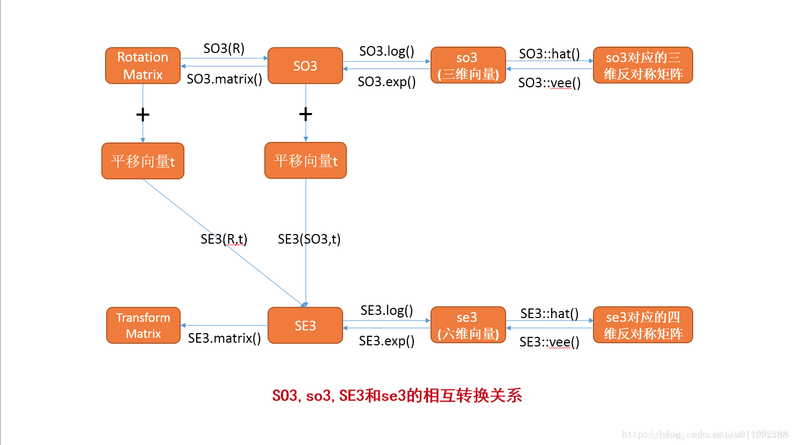

​	在CMakeLists.txt中，只需找到库，添加头文件即可

```cmake
find_package(Sophus REQUIRED)
include_directories(${Sophus_INCLUDE_DIRS})
```


### Ceres Solver库

```shell
# Ceres depencies
sudo apt-get install libgoogle-glog-dev libatlas-base-dev libsuitesparse-dev

# download ceres release version 2.0.0
https://github.com/ceres-solver/ceres-solver/releases

# unzip, mkdir build, cd build, cmake ../, make -j8, sudo make install

# uninstall  Ceres库的头文件安装在"/usr/local/include/ceres/"目录下，库文件安装在"/usr/local/lib/"目录
sudo rm -rf /usr/local/include/ceres /usr/local/lib/libceres.a

# using ceres 1.14

```


### g2o图优化库

**1、下载g2o**

链接[github下载地址](https://github.com/RainerKuemmerle/g2o)直接下载比较慢。

可以通过以下链接下载：链接：https://pan.baidu.com/s/1g5QpMNWeUdSI063qiMbZpA **提取码：aqxp** 

**2、安装依赖项**

参照g2o中README.md文件的说明，在安装包中

```shell
sudo apt-get install cmake libeigen3-dev libsuitesparse-dev qtdeclarative5-dev qt5-qmake libqglviewer-dev-qt5
```

**3、编译库文件**

```shell
mkidr build
cd build
cmake ..   	//很快
make -j8    //时间比较长 可以根据自己机器调节 通常为2 4 8 12
```

**4、安装库文件**

```shell
sudo make install
```


### Pangolin库

https://github.com/stevenlovegrove/Pangolin

Pangolin是一个轻量、便携的管理OpenGl显示、交互和提取的视频输入的快速开发库。其核心是一个简单的OpenGl视口管理器，它能帮助模块化3D可视化，不增加复杂性，提供一个先进且直接的3D导航处理器。Pangolin也提供一个操作程序的机制，这个机制通过配置文件和UI集成，有一个灵活的实时绘图仪，用于可视图形图像数据。
穿山甲的宗旨是在不影响性能的前提下，减少通常用于可视化和与(典型的图像和3D的)系统交互的样板代码。它还允许在许多平台上编写一次代码，目前包括Windows、Linux、OSX、Android和IOS。

#### 1. 安装

​    参考github的README

​	依赖项安装，只选择必要的依赖项，其它recommended和Optional依赖项没有安装，否则容易出现版本不匹配问题。

```shell
sudo apt install libgl1-mesa-dev		# OpenGL
sudo apt install libglew-dev			# OpenGL Extension Wrangler Library 用于帮助C/C++开发者初始化扩展（OpenGL扩展功能）并书写可移植的应用程序
sudo apt install cmake
```

​	编译

```shell

https://github.com/stevenlovegrove/Pangolin/tree/v0.6  # 下载tag为v0.6的版本
mkdir build
cd build
cmake ..
cmake --build .
sudo make install
```


#### 2. 使用测试

```shell
cd examples
cd HelloPangolin
mkdir build
cd build
cmake ..
make
./HelloPangolin
```

​	运行后，会显示如下方框图，鼠标左键是拖动，滚轮是缩放，右键旋转.

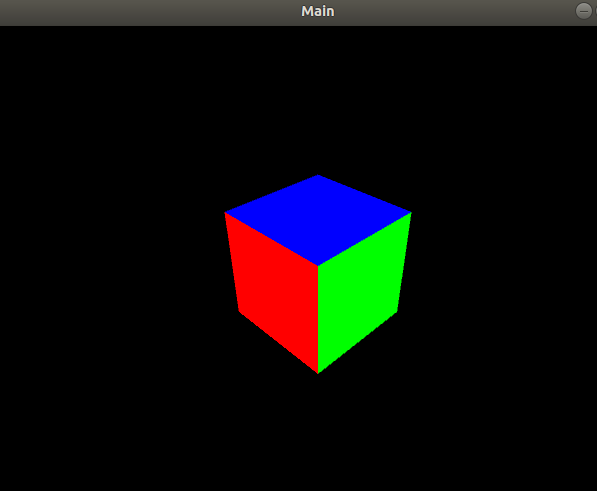


### OpenCV

#### 依赖项安装&编译

```
# download OpenCV 3.4.14
https://opencv.org/releases/
unzip opencv-3.4.14.zip
wget -O opencv_contrib.zip https://github.com/Itseez/opencv_contrib/archive/3.4.14.zip  # OpenCV3之后,SIFT/ SUFR功能就移到contrib
unzip opencv_contrib-3.4.14.zip

# 安装依赖
sudo apt-get install build-essential
sudo apt-get install cmake git libgtk2.0-dev pkg-config libavcodec-dev libavformat-dev libswscale-dev
sudo apt-get install python-dev python-numpy libtbb2 libtbb-dev libjpeg-dev libpng-dev libtiff5-dev libdc1394-22-dev # 处理图像所需的包
sudo apt-get install libavcodec-dev libavformat-dev libswscale-dev libv4l-dev liblapacke-dev
sudo apt-get install libxvidcore-dev libx264-dev         # 处理视频所需的包
sudo apt-get install libatlas-base-dev gfortran          # 优化opencv功能
sudo apt-get install ffmpeg
sudo apt-get install libgtk-3-dev						 # 用来操控OpenCV GUI的模块是highgui. highgui模块依赖GTK库

# 编译安装opencv
cd opencv-3.4.14
mkdir build
cd build
cmake -D CMAKE_BUILD_TYPE=Release -D CMAKE_INSTALL_PREFIX=/usr/local ..
make -j8
sudo make install
```


#### 配置环境

```
# 1) 
sudo /bin/bash -c 'echo "/usr/local/lib" > /etc/ld.so.conf.d/opencv.conf'
sudo ldconfig		# 默认搜寻/lilb和/usr/lib，以及配置文件/etc/ld.so.conf内所列的目录下的库文件; 创建出动态装入程序(ld.so)所需的连接和缓存文件。缓存文件默认为/etc/ld.so.cache


ps.
`pkg-config opencv --libs --cflags opencv`		# 编译的时候可以add the命令
$ pkg-config opencv --libs --cflags opencv
-I/usr/local/include/opencv -I/usr/local/include -L/usr/local/lib -lopencv_dnn -lopencv_highgui -lopencv_ml -lopencv_objdetect -lopencv_shape -lopencv_stitching -lopencv_superres -lopencv_videostab -lopencv_calib3d -lopencv_videoio -lopencv_imgcodecs -lopencv_features2d -lopencv_video -lopencv_photo -lopencv_imgproc -lopencv_flann -lopencv_core
```


#### OpenCV测试

1. 查看Opencv安装的版本号

```
pkg-config --modversion opencv
```

2. 在终端打开到opencv-3.4.14/sample/cpp/example_cmake目录，执行下面的代码

```shell
cmake .
make
./opencv_example
```

如果摄像头打开，左上角出现 Hello OpenCV 则证明安装成功


### Protocol buffers

​		protocol buffer是google的一个开源项目,它是用于结构化数据串行化的灵活、高效、自动的方法，例如XML，不过它比xml更小、更快、也更简单。你可以定义自己的数据结构，然后使用代码生成器生成的代码来读写这个数据结构。你甚至可以在无需重新部署程序的情况下更新数据结构

源码：https://github.com/protocolbuffers/protobuf/releases/latest

官方文档：https://developers.google.com/protocol-buffers/docs/overview

#### 安装

在ubuntu18.04上直接使用下面命令

```shell
sudo apt-get install libprotobuf-dev			# 安装
sudo apt-get remove libprotobuf-dev				# 御载
protoc --version	# 查看安装的版本

# 上面这种方式安装，在ubuntu18.04下版本为3.0,有些新功能不支持 

```

#### 使用

https://developers.google.com/protocol-buffers/docs/cpptutorial

在`.proto`文件定义消息，message是`.proto`文件最小的逻辑单元，由一系列name-value键值对构成。下面的`.proto`文件定义了一个"人"的消息：

```
message Person {
  required string name = 1;
  required int32 id = 2;
  optional string email = 3;

  enum PhoneType {
    MOBILE = 0;
    HOME = 1;
    WORK = 2;
  }

  message PhoneNumber {
    required string number = 1;
    optional PhoneType type = 2 [default = HOME];
  }

  repeated PhoneNumber phone = 4;
}
```

message消息包含一个或多个编号唯一的字段，每个字段由字段限制,字段类型,字段名和编号四部分组成，字段限制分为：optional(可选的)、required(必须的)以及repeated(重复的)。定义好消息后，使用ProtoBuf编译器生成C++对应的`.h`和`.cc`文件，源文件提供了message消息的序列化和反序列化等方法：

```
# 序列化数据
Person person;
person.set_name("John Doe");
person.set_id(1234);
person.set_email("jdoe@example.com");
fstream output("myfile", ios::out  | ios::binary);
person.SerializeToOstream(&output);

# 反序列化数据
fstream input("myfile", ios::in  | ios::binary);
Person person;
person.ParseFromIstream(&input);cout <<  "Name: "  << person.name()  << endl;cout <<  "E-mail: "  << person.email()  << endl;
```

#### 原理

转自：https://www.cnblogs.com/silvermagic/p/9087593.html		

​		同XML相比，Protobuf的优势在于高性能，它以高效的二进制存储方式比XML小3到10倍，快20到100倍，原因在于：

- ProtoBuf序列化后所生成的二进制消息非常紧凑
- ProtoBuf封解包过程非常简单

**Varint简介**

​		Varint 是一种紧凑的表示数字的方法。它用一个或多个字节来表示一个数字，值越小的数字使用越少的字节数。这能减少用来表示数字的字节数。

​		比如对于int32类型的数字，一般需要4个byte来表示，但是采用Varint对于很小的int32类型的数字，则可以用1个byte来表示。当然凡事都有好的也有不好的一面，采用Varint表示法，大的数字则需要5个byte来表示。从统计的角度来说，一般不会所有的消息中的数字都是大数，因此大多数情况下，采用Varint后可以用更少的字节数来表示数字信息。

**Varint格式**

​		Varint中的每个byte的最高位bit有特殊的含义，如果该位为1，表示后续的byte也是该数字的一部分，如果该位为0则结束，其他的7个bit都用来表示数字。因此小于128的数字都可以用一个byte表示，大于128的数字会用两个字节来表示。

**Varint编解码**

​		比如数值`300`用Varint来表示就是：1010 1100 0000 0010。下图演示了Google Protocol Buffer解析Varint表示的`300`的过程，由于Google Protocol Buffer采用小端字节序，所以实际存储的字节顺序是反过来的：


**Google Protocol Buffer序列化**

​		消息经过序列化后会成为一个二进制数据流，该流中的数据为一系列的Key-Value对。如下图所示：


​		采用这种Key-Pair结构无需使用分隔符来分割不同的 Field。对于可选的Field，如果消息中不存在该Field，那么在最终的Message Buffer中就没有该Field，这些特性都有助于节约消息本身的大小。Key 用来标识具体的Field，在解包的时候ProtoBuf根据Key就可以知道相应的Value应该对应于消息中的哪一个Field。Key由字段的编号和字段的线性传输类型构成`(field_number << 3) | wire_type`

| **wire_type** | **Meaning**   | **Used For**                                             |
| ------------- | ------------- | -------------------------------------------------------- |
| 0             | Varint        | int32, int64, uint32, uint64, sint32, sint64, bool, enum |
| 1             | 64-bit        | fixed64, sfixed64, double                                |
| 2             | Length-delimi | string, bytes, embedded messages, packed repeated fields |
| 3             | Start group   | Groups (deprecated)                                      |
| 4             | End group     | Groups (deprecated)                                      |
| 5             | 32-bit        | fixed32, sfixed32, float                                 |

- Google Protocol Buffer采用zigzag编码来用无符号数来表示有符号数字，zigzag采用正数和负数交错的方式来同时表示无符号数来表示有符号数字，如图所示：


使用zigzag编码，绝对值小的数字，无论正负都可以采用较少的byte来表示，充分利用了Varint这种技术。

- 其他的数据类型，比如字符串等则采用类似数据库中的varchar的表示方法，即用一个varint表示长度，然后将其余部分紧跟在这个长度部分之后即可。

**ProtoBuf编码与XML编码对比**

消息定义如下：

```protobuf
package lm;
message helloworld
{
   required int32     id = 1;  // ID
   required string    str = 2;  // str
   optional int32     opt = 3;  //optional field
}
```

假设有一条`helloworld`消息`id=101 str="hello"`，那么用Protobuf序列化后的字节序列为：

```
08 65 12 06 48 65 6C 6C 6F 77
```

而如果用XML，则类似这样：

```xml
31 30 31 3C 2F 69 64 3E 3C 6E 61 6D 65 3E 68 65
6C 6C 6F 3C 2F 6E 61 6D 65 3E 3C 2F 68 65 6C 6C
6F 77 6F 72 6C 64 3E

一共 55 个字节，这些奇怪的数字需要稍微解释一下，其含义用 ASCII 表示如下：
 <helloworld> 
    <id>101</id>
    <name>hello</name>
 </helloworld></pre>
```

**ProtoBuf封解包**

> 首先我们来了解一下XML的封解包过程。XML需要从文件中读取出字符串，再转换为XML文档对象结构模型。之后再从XML文档对象结构模型中读取指定节点的字符串，最后再将这个字符串转换成指定类型的变量，这个过程非常复杂。其中将XML文件转换为文档对象结构模型的过程通常需要完成词法文法分析等大量消耗 CPU 的复杂计算。
> 反观Protobuf，它只需要简单地将一个二进制序列按照指定的格式读取到C++对应的结构类型中就可以了。从上一节的描述可以看到，消息的解码过程也可以通过几个位移操作组成的表达式计算即可完成，速度非常快。

上面例子中，**Protobuf**解包**helloworld**消息的过程可以用下图表示：


整个解析过程需要**Protobuf**本身的框架代码和由**Protobuf**编译器生成的代码共同完成。其中**Message**以及**Message_lite**作为通用的流程框架，**CodedInputStream**、**WireFormatLite**提供了对二进制数据的解码功能，而且**Protobuf**的解码可以通过几个简单的数学运算完成，无需复杂的词法语法分析，因此图中**ReadTag()**等方法都非常快。相对于**XML**的解析，整个调用路径上的其他类和方法都非常简单，这也就是ProtoBuf封解包速度迅速的原因。


### Abseil库

​		Google 开源了其内部多年使用的 C++ 代码库 [Abseil](https://link.zhihu.com/?target=http%3A//abseil.io/) 作为 C++ 标准库的补充，并会对其进行持续更新。Google评价Abseil为：

- 它是从Google内部代码块中抽取出来的一系列最基础的软件库。作为基本的组成部分，这些软件库支撑了几乎全部Google在运行的项目。以前这些API是零零散散地嵌入在Google的大部分开源项目中，现在我们将它们规整在一起，形成这样一个全面的项目。

- Abseil是Google代码库的最基本构建模块，其代码经过了生产环节测试，此后还会继续得到完全的维护。

​        使用Abseil的优点在于可以访问一些目前依然尚未添加到标准中的C++特性，并且一旦这些特性被添加到C ++标准中，Google保证会重构这些特性为默认使用标准实现。Google鼓励开发人员使用Abseil，并提及已 有超过两亿五千万行的C++代码使用它，并且几乎所有从头开始构建的项目都使用了它。这意味着，Abseil已 被Google广为使用，并出于与项目需求同步的考虑而得以频繁维护。

#### 安装

参考官方教程C++ Quickstart With CMake: https://abseil.io/docs/cpp/quickstart-cmake.html

1. 下载源码

```shell
$ cd ~
$ mkdir Source && cd Source
$ git clone https://github.com/abseil/abseil-cpp.git

```

2. 构建工程

```shell
$ cd abseil-cpp
$ mkdir build && cd build
$ cmake -DBUILD_TESTING=ON -DABSL_USE_GOOGLETEST_HEAD=ON -DCMAKE_CXX_STANDARD=11 ..
```

CMAKE_CXX_STANDARD=11指示CMAKE使用C++11标准进行构建，这是abseil支持的最低语言级别。

3. 编译及测试

```shell
$ cmake --build . --target all		# 编译
$ ctest								# 测试
```

4. 安装

```shell
$ sudo make install
...
Install the project...
-- Install configuration: ""
-- Installing: /usr/local/lib/cmake/absl/abslTargets.cmake
-- Installing: /usr/local/lib/cmake/absl/abslTargets-noconfig.cmake
-- Installing: /usr/local/lib/cmake/absl/abslConfig.cmake
-- Installing: /usr/local/include/absl
-- Installing: /usr/local/include/absl/container
-- Installing: /usr/local/include/absl/container/btree_map.h
-- Installing: /usr/local/include/absl/container/node_hash_set.h
-- Installing: /usr/local/include/absl/container/inlined_vector.h
-- Installing: /usr/local/include/absl/container/flat_hash_set.h
...
-- Installing: /usr/local/lib/pkgconfig/absl_atomic_hook.pc
-- Installing: /usr/local/lib/pkgconfig/absl_errno_saver.pc
-- Installing: /usr/local/lib/pkgconfig/absl_log_severity.pc
-- Installing: /usr/local/lib/libabsl_log_severity.a
-- Installing: /usr/local/lib/pkgconfig/absl_raw_logging_internal.pc
-- Installing: /usr/local/lib/libabsl_raw_logging_internal.a
-- Installing: /usr/local/lib/pkgconfig/absl_spinlock_wait.pc
-- Installing: /usr/local/lib/libabsl_spinlock_wait.a
-- Installing: /usr/local/lib/pkgconfig/absl_config.pc
...
```

主要安装在四个目录

- /usr/local/lib/cmake/absl            absl所有cmake相关文件
- /usr/local/include/absl/               absl所有头文件
- /usr/local/lib/                                 libabsl_*的库文件
- /usr/local/lib/pkgconfig/              absl_*的配置文件

若要卸载，手动删除这些文件即可

​		**Google官方文档提到**：尽管将Abseil安装到公共位置会很方便，可以供多个项目使用，但将Abseil的头分支安装到系统安装目录（如/usr/local）中是不安全的，并且容易违反一个定义规则（ODR）。在使用过程中包含头文件会有absl前缀，不理解为何安装到/usr/local会不安全，暂时先这样用吧！！！


#### 使用测试

https://abseil.io/docs/cpp/tools/cmake-installs

创建测试代码hello_world.cc

```c++
#include <iostream>
#include <string>
#include <vector>
#include "absl/strings/str_join.h"

int main() {
  std::vector<std::string> v = {"foo","bar","baz"};
  std::string s = absl::StrJoin(v, "-");

  std::cout << "Joined string: " << s << "\n";
}
```


创建CMakeLists.txt文件

```cmake
cmake_minimum_required(VERSION 3.5)

project(my_project)

# Abseil requires C++11
set(CMAKE_CXX_STANDARD 11)

# Process Abseil's CMake build system源码方式
# add_subdirectory(abseil-cpp)

# Import Abseil's CMake targets二进制库方式
find_package(absl REQUIRED)

add_executable(hello_world hello_world.cc)

# Declare dependency on the absl::strings library
target_link_libraries(hello_world absl::strings)
```


编译、运行测试

```shell
$ mkdir build && cd build
$ cmake ..
$ cmake --build . --target hello_world
$ ./hello_world
Joined string: foo-bar-baz
```


### gtest库


GoogleTest Quickstart: https://google.github.io/googletest/quickstart-cmake.html

GoogleTest Primer: https://google.github.io/googletest/primer.html

#### 安装

1. Ubuntu直接通过控制台安装

```shell
sudo apt-get install libgtest-dev
```

2. 编译gtest链接库

```shell
cd /usr/src/gtest		# 进入gtest文件夹
sudo mkdir build 
cd build
sudo cmake ..  			# 一定要以sudo的方式运行，否则没有写入权限
sudo make      			# 这个也一样要以sudo的方式
```

3.将生成的libgtest.a 和 libgtest_main.a 拷贝到系统的lib路径下

```
sudo cp libgtest*.a /usr/local/lib
```

​		到此为止，环境已经搭建完毕，接下来是代码测试


#### 使用测试

在gtest_demo.cpp中输入如下内容：

```c++
#include <gtest/gtest.h>

int add(int a,int b)
{
  return a+b;
}

TEST(testCase, test0)
{
  EXPECT_EQ(add(2,3), 5);
}

// Demonstrate some basic assertions.
TEST(HelloTest, BasicAssertions)
{
  // Expect two strings not to be equal.
  EXPECT_STRNE("hello", "world");
  // Expect equality.
  EXPECT_EQ(7 * 6, 42);
}

int main(int argc,char*argv[])
{
   testing::InitGoogleTest(&argc,argv);
   return RUN_ALL_TESTS();
}
```


编写CMakeLists.txt

```cmake
cmake_minimum_required(VERSION 2.6)
project(vscode_cmake)   # 工程vscode_cmake

# C++11, dubug模式
set(CMAKE_BUILD_TYPE Release)
set(CMAKE_CXX_FLAGS  "${CMAKE_CXX_FLAGS} -std=c++11 -g")

add_executable(gtest_demo "gtest_demo.cpp")
target_link_libraries(gtest_demo gtest pthread)
```


运行gtest_demo，输出结果如下：

```sh
[==========] Running 2 tests from 2 test cases.
[----------] Global test environment set-up.
[----------] 1 test from testCase
[ RUN      ] testCase.test0
[       OK ] testCase.test0 (0 ms)
[----------] 1 test from testCase (0 ms total)

[----------] 1 test from HelloTest
[ RUN      ] HelloTest.BasicAssertions
[       OK ] HelloTest.BasicAssertions (0 ms)
[----------] 1 test from HelloTest (0 ms total)

[----------] Global test environment tear-down
[==========] 2 tests from 2 test cases ran. (0 ms total)
[  PASSED  ] 2 tests.
```


#### 断言使用说明

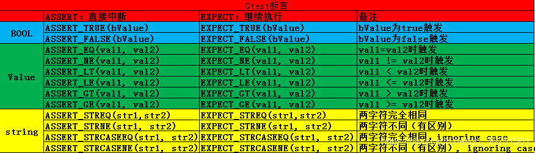


### ROS Melodic安装

安装根据官网提供的流程和命令依次执行即可

http://wiki.ros.org/melodic/Installation/Ubuntu

**问题1**：

执行如下命令添加apt-key时

```shell
curl -s https://raw.githubusercontent.com/ros/rosdistro/master/ros.asc | sudo apt-key add -
```

出现

```shell
gpg: no valid OpenPGP data found
```

**解决办法**：

进入 IPAddress.com，输入 raw.githubusercontent.com 查询真实的IP地址，查到多个IP地址时，通过ping选择延时最短的，假如现在查到的是 199.232.68.133
编辑修改 `sudo vim /etc/hosts` 

添加

```
199.232.68.133      raw.githubusercontent.com
```

**原理解析**：

​	hosts（the static table lookup for host name主机名查询静态表）文件是Linux系统上一个负责ip地址与域名快速解析的文件，以ascii格式保存在/etc/目录下。hosts文件包含了ip地址与主机名之间的映射，还包括主机的别名。在没有域名解析服务器的情况下，系统上的所有网络程序都通过查询该文件来解析对应于某个主机名的ip地址，否则就需要使用dns服务程序来解决。通过可以将常用的域名和ip地址映射加入到hosts文件中，实现快速方便的访问。 

优先级

​	dns缓存 > hosts > dns服务

hosts格式配置

​	hosts文件可以配置主机ip与对应的主机名。在局域网或者是万维网上，每台主机都有一个ip地址，它区分开每台主机，并可以根据ip进行通讯。但是Ip地址不符合人脑的记忆规律，因此出现了域名，例如www.baidu.com.在一个局域网中，每台机器都有一个主机名，用于区分主机，便于相互访问。

hosts文件格式

​	ip地址  主机名/域名  （主机别名）

主机名和域名的区别在于：

- 主机名通常在局域网内使用，通过hosts文件，主机名就被解析到对应的ip。
- 域名通常在internet上使用，但是优先级低于hosts文件中内容，因此如果你不想使用internet上的域名解析，可以更改自己的hosts文件，加入自己的域名解析。

hosts文件作用

​	一个主要的作用是：线下环境模拟，通信双方在同一个局域网内想通过internet上的域名相互访问，则只需要修改自己的/etc/hosts文件内容即可。 

例如，修改www.baidu.com的ip为127.0.0.1


## CMake使用教程

CMake入门实战： https://www.hahack.com/codes/cmake/

### 1 基本语法特性

1.1 基本语法格式：指令(参数1 参数2)

- 参数使用**括弧**括起
- 参数之间使用**空格**或**分号**分开

1.2 指令是大小写无关的

```cmake
add_executable(hello main.cpp hello.cpp)
ADD_EXECUTABLE(hello main.cpp hello.cpp)
```

1.3 变量是大小写相关的，使用**${}**方式**取值**。但在**if**语句中是直接使用变量名

```cmake
set(HELLO hello.cpp)  # 设置一个变量HELLO，值是hello.cpp
add_executable(hello main.cpp ${HELLO})
```

### 2 重要指令和常用变量

#### 2.1 重要指令

- cmake_minimum_required

    功能：指定CMake的最小版本要求
    语法：`cmake_minimum_required(VERSION 版本号 [FATAL_ERROR])`

    ```cmake
    # CMake最小版本要求为2.8.3
    cmake_minimum_required(VERSION 2.8.3)
    ```

- project

    功能：定义工程名称，并可指定工程支持的语言

    语法：`project(工程名称 [CXX] [C] [java])`

    ```cmake
    # 指定工程名为HELLOWORLD
    project(HELLOWORLD)
    ```

- set

    功能：显式的定义变量

    语法：`set(变量名 [变量值] [CACHE TYPE DOCSTRING [FORCE]])`

    ```cmake
    # 定义SRC变量，其值为main.cpp hello.cpp
    set(SRC sayhello.cpp hello.cpp)
    ```

- include_directories

    功能：向工程添加多个特定的头文件搜索路径，相当于指定g++编译器的-I参数

    语法：`include_directories([AFTER|BEFORE][SYSTEM] dir1 dir2 ...)`

    ```cmake
    # 将/usr/include/myincludefolder 和 ./include 添加到头文件搜索路径
    include_directories(/usr/include/myincludefolder ./include)
    ```

- link_directories

    功能：向工程添加多个特定的库文件搜索路径，相当于指定g++编译器的-L参数

    语法：`link_directories(dir1 dir2 ...)`

    ```cmake
    # 将/usr/lib/mylibfolder 和 ./lib 添加到库文件搜索路径
    link_directories(/usr/lib/mylibfolder ./lib)
    ```

- add_library

    功能：生成库文件

    语法：`add_library(库名 [SHARED|STATIC|MODULE] [EXCLUDE_FROM_ALL] source1 source2 .. sourceN)`

    ```cmake
    # 通过变量 SRC 生成 libhello.so 共享库
    # SHARED代表动态库，STATIC代表静态库
    add_library(hello SHARED ${SRC})
    ```

- add_compile_options

    功能：添加编译参数

    语法：`add_compile_options(编译参数)`

    ```cmake
    # 添加编译参数 -wall -std=c++11
    add_compile_options(-wall -std=c++11 -o2)
    ```

- add_executable

    功能：生成可执行文件

    语法：`add_executable(exe文件名 source1 source2 .. sourceN)`

    ```cmake
    # 编译main.cpp生成可执行文件main
    add_executable(main main.cpp)
    ```

- target_link_libraries

    功能：为target添加需要链接的共享库，相当于指定g++编译器-l参数

    语法：`target_link_libraries(target library1<debug|optimized> library2...)`

    ```cmake
    # 将hello动态库文件链接到可执行文件main
    target_link_libraries(main hello)
    ```

- add_subdirectory

    功能：向当前工程添加存放源文件的子目录，并可以指定中间二进制和目标二进制存放的位置

    语法：`add_subdirectory(source_dir [binary_dir] [EXCLUDE_FROM_ALL])`

    ```cmake
    # 添加src子目录，src中需要有一个CMakeLists.txt
    add_subdirectory(src)
    ```

- aux_source_directory

    功能：发现一个目录下所有的源代码文件并将列表存储在一个变量中，这个指令临时被用来自动构建源文件列表

    语法：`aux_source_directory(文件夹路径 变量名)`

    ```cmake
    # 定义SRC变量，其值为当前目录下所有的源代码文件
    aux_source_directory(. SRC)
    # 编译SRC变量所代表的源代码文件，生成main可执行文件
    add_executable(main ${SRC})
    ```

- message

  功能：

  语法：`message( [STATUS|WARNING|AUTHOR_WARNING|FATAL_ERROR|SEND_ERROR] "message to display" ...)`

  ```cmake
  # (无) = 重要消息；
  # STATUS = 非重要消息；
  # WARNING = CMake 警告, 会继续执行；
  # AUTHOR_WARNING = CMake 警告 (dev), 会继续执行；
  # SEND_ERROR = CMake 错误, 继续执行，但是会跳过生成的步骤；
  # FATAL_ERROR = CMake 错误, 终止所有处理过程；
  message("++++++++++++++Start Build+++++++++++++++++")
  
  # 输出变量的值
  set(USER_KEY, "Hello World")
  message(STATUS "this var key = ${USER_KEY}.")
  ```

- execute_process

     功能：调用shell命令或者脚本

    语法：

    ```cmake
    execute_process(COMMAND <cmd1> [args1...]]
                    [COMMAND <cmd2> [args2...] [...]]
                    [WORKING_DIRECTORY <directory>]
                    [TIMEOUT <seconds>]
                    [RESULT_VARIABLE <variable>]
                    [OUTPUT_VARIABLE <variable>]
                    [ERROR_VARIABLE <variable>]
                    [INPUT_FILE <file>]
                    [OUTPUT_FILE <file>]
                    [ERROR_FILE <file>]
                    [OUTPUT_QUIET]
                    [ERROR_QUIET]
                    [OUTPUT_STRIP_TRAILING_WHITESPACE]
                    [ERROR_STRIP_TRAILING_WHITESPACE])
    # 按指定的先后顺序运行一个或多个命令，每个进程的输出通过管道连接作为下一个进程的输入。所有的进程使用单个的标准错误输出管道。
    # 如果指定了WORKING_DIRECTORY，则指定的目录将作为子进程当前的工作目录。
    # 如果指定了TIMEOUT值，则如果在指定的时间内（以秒为单位计算，允许有小数位）子进程执行仍未完成，则将会被中断。
    # 如果指定了RESULT_VARIABLE变量，则最后命令执行的结果将保存在该变量中，它是最后一个子进程执行完后的返回值或描述某种错误信息的字符串。
    # 如果指定了OUTPUT_VARIABLE或ERROR_VARIABLE变量，则该变量会分别保存标准输出和标准错误输出的内容。
    # 如果指定的变量是同一个，则输出会按产生的先后顺序保存在该变量中。
    # 如果指定了INPUT_FILE，UTPUT_FILE或ERROR_FILE等文件名，则它们会分别与第一个子进程的标准输入，最后一个子进程的标准输出以及所有子进程的标准错误输出相关联。
    # 如果指定了OUTPUT_QUIET或ERROR_QUIET，则会忽略标准输出和错误输出。如果在同一管道中同时指定了多个OUTPUT_*或ERROR_*选项，则优先级顺序是未知的（应避免这种情况）。
    # 如果未指定任何OUTPUT_*或ERROR_*选项，则命令CMake所在进程共享输出管道。
    ```

     示例：

    ```cmake
    execute_process(COMMAND <一句shell命令> WORKING_DIRECTORY <这句shell命令执行的工作目录>)	 # 执行shell命令
    execute_process(COMMAND sh test.sh WORKING_DIRECTORY <test.sh所在目录>)					# 执行shell脚本
    ```

    

    

    


#### 2.2 常用变量

- CMAKE_BUILD_TYPE / CMAKE_C_FLAGS / CMAKE_CXX_FLAGS

    功能：编译类型(Debug, Release) / gcc编译选项 / g++编译选项

    ```cmake
    # 设定编译类型为debug，因为在调试时需要选择debug
    set(CMAKE_BUILD_TYPE Debug)
    # set(CMAKE_BUILD_TYPE Release)
    
    # 在CMAKE_CXX_FLAGS编译选项后追加-std=c++11
    # 优化
    # 让CMake支持gdb调试，追加-g选项
    set(CMAKE_CXX_FLAGS_DEBUG "${CMAKE_CXX_FLAGS} -std=c++11 -O0 -Wall -g -ggdb")
    set(CMAKE_CXX_FLAGS_RELEASE "${CMAKE_CXX_FLAGS} -std=c++11 -O3 -Wall")
    ```

​       附gcc/g++编译选项

**常用选项**

`-E`：只进行预处理，不编译
`-S`：只编译，不汇编
`-c`：只编译、汇编，不链接
`-g`：包含调试信息
`-I`：指定include包含文件的搜索目录
`-o`：输出成指定文件名

**高级选项**

`-v`：详细输出编译过程中所采用的每一个选项
`-C`：预处理时保留注释信息
`-ggdb`：在可执行文件中包含可供`GDB`使用的调试信息
`-fverbose-asm`：在编译成汇编语言时，把C变量的名称作为汇编语言中的注释
`-save-temps`：自动输出预处理文件、汇编文件、对象文件，编译正常进行
`-fsyntax-only`：只测试源文件语法是否正确，不会进行任何编译操作
`-ffreestanding`：编译成独立程序，而非宿主程序

**语言标准**

`-ansi`：ANSI标准
`-std=c99`：C99标准
`-std=c++11`:C++11标准
`-std=gnu89`：ISO/IEC 9899:1990 以及GNU扩充
`-std=gnu99`：ISO/IEC 9899:1999 以及GNU扩充
`-trigraphs`：支持ISO C三字符组

**出错提示**

`-w`：忽略所有警告
`-Werror`：不区分警告和错误，遇到任何警告都停止编译
`-Wall`：开启大部分警告提示
`-Wshadow`：某语句块作用域变量与更大作用域的另一变量同名时发出警告（此警告未包含在`-Wall`选项中，需单独开启）
`-Wextra`：对所有合法但值得怀疑的表达式发出警告

**优化选项**

`-O0`：关闭所有优化选项
`-O1`：第一级别优化，使用此选项可使可执行文件更小、运行更快，并不会增加太多编译时间，可以简写为`-O`
`-O2`：第二级别优化，采用了几乎所有的优化技术，使用此选项会延长编译时间
`-O3`：第三级别优化，在`-O2`的基础上增加了产生`inline`函数、使用寄存器等优化技术
`-Os`：此选项类似于`-O2`，作用是优化所占用的空间，但不会进行性能优化，常用于生成最终版本


- 

    功能：

    ```cmake
    # 设定编译类型为debug，因为在调试时需要选择debug
    set(CMAKE_BUILD_TYPE Debug)
    # 设定编译类型为release，因为在发布时需要选择release
    set(CMAKE_BUILD_TYPE Release)
    ```

- PROJECT_SOURCE_DIR / PROJECT_BINARY_DIR

    功能： 存放顶层CMakeLists.txt文件的目录 /  执行cmake命令所在的目录，即编译源码的目录
    
    ```cmake
    # 若在build下编译, ${PROJECT_BINARY_DIR} -- ${PROJECT_SOURCE_DIR}/build
    message(STATUS "This is SOURCE dir " ${PROJECT_SOURCE_DIR})
    message(STATUS "This is BINARY dir " ${PROJECT_BINARY_DIR})
    ```
    
- EXECUTABLE_OUTPUT_PATH

    功能：可执行文件输出的存放路径
    
    ```cmake
    set(EXECUTABLE_OUTPUT_PATH ${PROJECT_SOURCE_DIR}/bin)
    ```

- LIBRARY_OUTPUT_PATH

    功能：库文件输出的存放路径
    
    ```cmake
    set(LIBRARY_OUTPUT_PATH ${PROJECT_SOURCE_DIR}/lib)
    ```
    
    


### 3 多目录工程示例

目录结构

```
./Demo3
    |
    +--- main.cc
    |
    +--- math/
          |
          +--- MathFunctions.cc
          |
          +--- MathFunctions.h
```

#### **3.1 使用静态库的处理方式**

根目录中的CMakeLists.txt

```cmake
# CMake 最低版本号要求
cmake_minimum_required (VERSION 2.8)

# 项目信息
project (Demo3)

# 查找当前目录下的所有源文件
# 并将名称保存到 DIR_SRCS 变量
aux_source_directory(. DIR_SRCS)

# 添加 math 子目录
add_subdirectory(math)

# 指定生成目标 
add_executable(Demo main.cc)

# 添加链接库
target_link_libraries(Demo MathFunctions)
```

子目录中的CMakeLists.txt

```cmake
# 查找当前目录下的所有源文件
# 并将名称保存到 DIR_LIB_SRCS 变量
aux_source_directory(. DIR_LIB_SRCS)

# 生成链接库
add_library (MathFunctions ${DIR_LIB_SRCS})
```

#### **3.2 不使用静态库的处理方式**

根目录中的CMakeLists.txt

```cmake
# CMake 最低版本号要求
cmake_minimum_required (VERSION 2.8)

# 项目信息
project (Demo3_1)

set(ALL_SOURCES CACHE INTERNAL "All sources to be compiled in this project" )

# 添加 src 子目录
add_subdirectory(src)

# 指定生成目标
include_directories(src)
add_executable(Demo main.cpp ${ALL_SOURCES})
```

子目录中的CMakeLists.txt

```cmake
# 添加源文件到变量 
set(SDS_STATES_ALL_SOURCES  ${PROJECT_SOURCE_DIR}/src/MathFunctions.cc)

set(ALL_SOURCES
    ${SDS_STATES_ALL_SOURCES}
    PARENT_SCOPE
   )
```


## VS Code+CMake的C++开发环境

参考: https://blog.csdn.net/try_again_later/article/details/106770319

### 1. 安装VS Code及相关插件

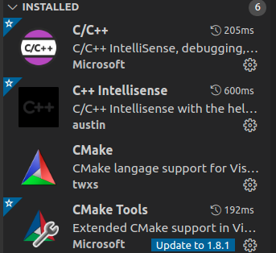

### 2. 测试代码

main.cpp

```cpp
#include<iostream>
 
using namespace std;
 
int main(){
 
    int a = 2+3;
    int b = a+3;
 
    for(int i = 0; i<10; i++){
        cout<<"hello vs code & cmake..."<<endl;
    }
    
    return 0;
}
```

CMakeLists.txt

```cmake
cmake_minimum_required(VERSION 2.6)
# 工程vscode_cmake
project(vscode_cmake)

#dubug 模式
set(CMAKE_BUILD_TYPE "Debug") 

set(SRC_LIST main.cpp)
# 可执行程序 result
add_executable(result ${SRC_LIST})
```

**注意**：需要在CMakeLists.txt 里加

`set(CMAKE_BUILD_TYPE debug) `

或者

`set (CMAKE_CXX_FLAGS "${CMAKE_CXX_FLAGS} -g")`
开启debug 不然断点调试是无效的

### 3. 编译

方式1：通过task.json配置

​		快捷键ctrl+shift+p打开命令行，输入：`Task:Configure Task` 使用模版创建Tasks.json文件 --> Others：


对task.json进行修改：

```json
{
    // See https://go.microsoft.com/fwlink/?LinkId=733558
    // for the documentation about the tasks.json format
    "version": "2.0.0",
    "tasks": [
        {
            "label": "make build",						//编译的项目名，build，更改
            "type": "shell",
            "command": "cd ./build; cmake ../; make", 	//编译命令，更改
            "group": {
                "kind": "build",
                "isDefault": true
            }
        },
        {
            "label": "clean",
            "type": "shell",
            "command": "make clean",
        }
    ]
}
```

方式2：CMake Tools


### 4. 调试

​		在图中最左侧第四个小蜘蛛形状的图标（调试），点击左上方的小齿轮，添加配置（C++GDB/LLDB），修改launch.json文件为：

```json
{
    // Use IntelliSense to learn about possible attributes.
    // Hover to view descriptions of existing attributes.
    // For more information, visit: https://go.microsoft.com/fwlink/?linkid=830387
    "version": "0.2.0",
    "configurations": [
        {
            "name": "(gdb) Launch",
            "type": "cppdbg",
            "request": "launch",
            "program": "${workspaceFolder}/build/result",       // 修改
            "args": [],
            "stopAtEntry": false,
            "cwd": "${fileDirname}",
            "environment": [],
            "externalConsole": false,
            "MIMode": "gdb",
            "setupCommands": [
                {
                    "description": "Enable pretty-printing for gdb",
                    "text": "-enable-pretty-printing",
                    "ignoreFailures": true
                }
            ]
        }
    ]
}
```

​	接下来设置断点，按下F5，进行调试


### 5. 配置C++ IntelliSense

​		使用vscode进行c++代码编写时，配置代码includePath能够提供函数跳转，自动补全以及报错等帮助。

​		Ctrl+shift+p打开命令选项，选择C/C++:Edit configuration ，自动生成 c_cpp_properties.json配置文件。

```json
{
    "configurations": [
        {
            "name": "Linux",
            "includePath": [
                "${workspaceFolder}/**"
            ],
            "defines": [],
            "compilerPath": "/usr/bin/gcc",
            "cStandard": "gnu11",
            "cppStandard": "gnu++14",
            "intelliSenseMode": "linux-gcc-x64"
        }
    ],
    "version": 4
}
```


​		由于有些库的路径不太好找且逐条添加到vscode中过于繁琐，本处介绍使用cmake导出json的方式介绍配置vscode环境(适用于CMakeLists.txt编译方式)。**我们利用compile_commands.json配置includePath环境。**

1. **生成compile_commands.json**		

​		生成compile_commands.json有两种方式。方式1：在cmake时，添加`-DCMAKE_EXPORT_COMPILE_COMMANDS=YES`选项

```shell
cd project_dir		
mkdir build  		
cd build
cmake -DCMAKE_EXPORT_COMPILE_COMMANDS=YES ..		# 生成makefile同时导出json文件
# catkin_make -DCMAKE_EXPORT_COMPILE_COMMANDS=YES	# ROS也是类似
make
```

​		方式2：在CMakeLists.txt中添加

```cmake
set(CMAKE_EXPORT_COMPILE_COMMANDS ON)		# ON和YES等效
```


2. **向vscode中添加json文件**

​		将会在.vscode文件夹下生成c_cpp_properties.json文件，打开后新增compileCommands选项，将第一部分生成的compile_commands.json文件路径添加到c_cpp_properties.json的compileCommands下，样式如下所示：

```json
{
    "configurations": [
        {
            "name": "Linux",
            "includePath": [
                "${workspaceFolder}/**",
                "/usr/include",             // 增加
                "/usr/local/include",       // 增加
                "/usr/include/eigen3"       // 增加
            ],
            "defines": [],
            "compilerPath": "/usr/bin/gcc",
            "cStandard": "gnu11",
            "cppStandard": "gnu++14",
            "intelliSenseMode": "linux-gcc-x64",
            "compileCommands": "${workspaceFolder}/build/compile_commands.json"     // 增加
        }
    ],
    "version": 4
}
```


---

from: https://www.cnblogs.com/cong-wang/p/15026530.html

​		**CMake Tools插件**

​		CMake Tools插件能够给`C/C++插件`提供信息，实现IntelliSense、代码补全、注释浏览、文件转跳等功能。一般在第一次使用`CMake Tools插件`时会出现如下提示：

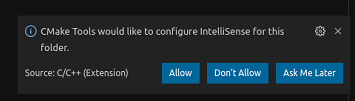


Allow之后会在当前工作目录的`.vscode/settings.json`文件（即当前工作目录的设置文件，会覆盖用户设置文件）中添加：

```json
{
    "C_Cpp.default.configurationProvider": "ms-vscode.cmake-tools"
}
```

当然，也可以在`C/C++插件`的配置文件`.vscode/c_cpp_properties.json`中手动指定`configurationProvider`：

```json
{
    "configurations": [
        {
            "name": "Linux",
            "includePath": [],
            "defines": [],
            "compilerPath": "/usr/bin/gcc",
            "cStandard": "gnu11",
            "cppStandard": "gnu++14",
            "intelliSenseMode": "gcc-x64",
            "configurationProvider": "ms-vscode.cmake-tools"
        }
    ],
    "version": 4
}
```

这样`C/C++插件`就能正常工作了，不用自己指定`.vscode/c_cpp_properties.json`的`includePath`和`defines`。

**原理**

- `configurationProvider`：

> The ID of a VS Code extension that can provide IntelliSense configuration information for source files. For example, use the VS Code extension ID ms-vscode.cmake-tools to provide configuration information from the CMake Tools extension.

- `compileCommands`：

> The full path to the compile_commands.json file for the workspace. The include paths and defines discovered in this file will be used instead of the values set for includePath and defines settings. If the compile commands database does not contain an entry for the translation unit that corresponds to the file you opened in the editor, then a warning message will appear and the extension will use the includePath and defines settings instead.


### 6. vscode远程连接GUI显示配置

1. 保证本地vscode与服务器之间ssh连接为密钥连接，并且vscode能够正常连 接服务器并正常操作
2. 在vscode插件市场安装插件

- 本地安装Remote X11（SSH）插件  (Joel Spadin)
- 远程服务器安装 Remote X11  插件  (Joel Spadin)

3. 本地win安装xserver服务
   安装xserver的方式有很多种

   方式1：mobaxterm自带xserver，所以打开mobaxterm放边上
   方式2：安装VcXsrv（微软官方推荐）
   方式3：安装xming


## 代码编写规范工具

研五部软件编程规范 ReleaseV1.0

/xm-TV-02/DATA/XEC/ENG/研五部/已审资料/08 法规和标准文件/30 软件编程规范

### cppcheck静态检查工具

官网：https://cppcheck.sourceforge.io/

​		Cppcheck是用在C、C++中对code进行静态检查的工具。

​		Cppcheck可以检查不通过编译的文件，执行的检查包括：(1)、自动变量检查；(2)、数组的边界检查；(3)、class类检查；(4)、过期的函数，废弃函数调用检查；(5)、异常内存使用，释放检查；(6)、内存泄漏检查，主要是通过内存引用指针；(7)、操作系统资源释放检查，中断，文件描述符等；(8)、异常STL 函数使用检查；(9)、代码格式错误，以及性能因素检查。

参考：https://blog.csdn.net/fengbingchun/article/details/77803920

**安装**

- 命令安装方式：

```shell
sudo apt-get install cppcheck    # 安装
sudo apt-get remove cppcheck     # 卸载
```

​	通过`cppcheck --version` 查看版本，在ubuntu18.04系统上是1.82。

- 源码安装方式：

​	从`https://github.com/danmar/cppcheck`下载源码，注意选择Tag下的版本。

```shell
unzip cppcheck-2.5.zip
cd cppcheck-2.5
mkdir build
cd build
cmake ..
cmake --build .		# make -j8
sudo make install
```


**VS Code中使用**

​		在系统上安装Cppcheck后，VSCode安装插件C/C++ Advanced Lint，该插件安装后，会自动与系统上安装的静态检查工具关联，目前支持的静态检查工具有:

- [Clang](https://clang.llvm.org/)
- [CppCheck](http://cppcheck.sourceforge.net/)
- [FlawFinder](https://dwheeler.com/flawfinder/)
- [PC-lint Plus](https://gimpel.com/)
- [Flexelint](http://www.gimpel.com/html/flex.htm) or [PC-lint](http://www.gimpel.com/html/pcl.htm)
- [lizard](https://github.com/terryyin/lizard)

​        这些工具有些是收费的，有些是开源的，需要先在系统中安装对应工具，就可以通过这个插件在VSCode上使用该工具，最新版插件还支持lizard，实现代码复杂度统计。

​		在编码完保存文件时，cppcheck就会对该文件进行静态检查，如有错误，就会报错，在代码中根据错误等级用红(error)、黄(warning)、蓝(style)颜色波浪线标记，同时在vscode的Problems窗口会详细列出错误出现的位置以及错误内容，直接点击就可以跳转过去。

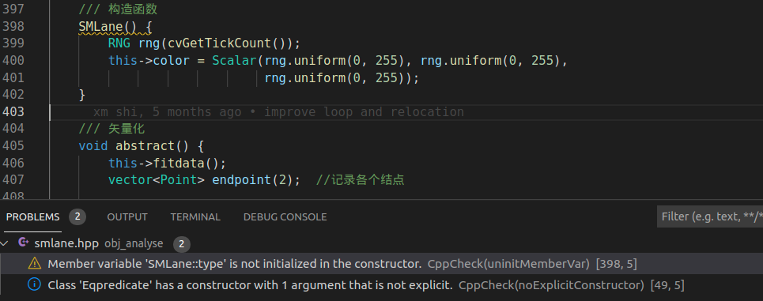


### clang-format格式自动规范化

​		clang-format支持标准格式，如Google、LLVM、WebKit、Mozilla等，也可以支持自定义的格式，它可以自动帮你格式化文件格式，使编码好的文件按照指定的格式进行格式化。目前同致算法内部采用的是自定义的Google编码格式，在Google编码格式基础上把缩进从2个字符改为4个字符，具体见附件，其文件中各种参数的含义可参考网址：https://clang.llvm.org/docs/ClangFormatStyleOptions.html

**系统上安装**

https://blog.csdn.net/sinat_34986308/article/details/116116780

```
sudo apt-get install clang-format
```


**VS Code中使用**

​		1. 安装Clang-Format插件

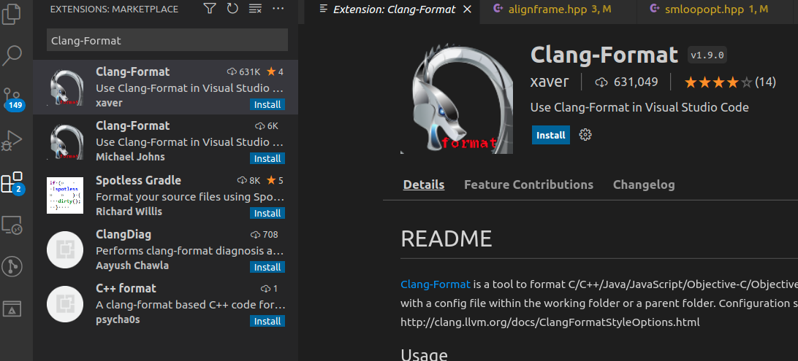

​		2. 创建.clang-format文件到工作目录下，在里面自己写好希望保存的代码格式，下面是基于google格式，稍微加了一点改动，仅供参考

```json
#基础样式
BasedOnStyle: Google
#指针的*的挨着哪边
PointerAlignment: Right
#访问修饰符前的空格
AccessModifierOffset: -4
# 缩进宽度
IndentWidth: 4
# 连续的空行保留几行
MaxEmptyLinesToKeep: 1
# 圆括号的换行方式
BreakBeforeBraces: Attach
# 是否允许短方法单行
AllowShortFunctionsOnASingleLine: true
# 支持一行的if
AllowShortIfStatementsOnASingleLine: true
# 在未封闭(括号的开始和结束不在同一行)的括号中的代码是否对齐
AlignAfterOpenBracket: true
# switch的case缩进
IndentCaseLabels: true
# 针对OC的block的缩进宽度
ObjCBlockIndentWidth: 4
# 针对OC，属性名后加空格
ObjCSpaceAfterProperty: true
# 每行字符的长度
ColumnLimit: 120
# 注释对齐
AlignTrailingComments: true
# 括号后加空格
SpaceAfterCStyleCast: false
# 换行的时候对齐操作符
AlignOperands: true
# 中括号两边空格 []
SpacesInSquareBrackets: false
# 多行声明语句按照=对齐
AlignConsecutiveDeclarations: false
# 容器类的空格 例如 OC的字典
SpacesInContainerLiterals: false
# 在构造函数初始化时按逗号断行，并以冒号对齐
BreakConstructorInitializersBeforeComma: true
# 函数参数换行
AllowAllParametersOfDeclarationOnNextLine: true
#在续行(#     下一行)时的缩进长度
ContinuationIndentWidth: 4
# tab键盘的宽度
TabWidth: 4
# 赋值运算符前加空格
SpaceBeforeAssignmentOperators: true
# 行尾的注释前加1个空格
SpacesBeforeTrailingComments: 1
```


3. 在插件中如下设置，注意是**在C/C++插件下**


​	4. 使用

方法1：当我们设置好之后，打开文件，右键选中Format Document，就会自动把你的代码按选中的格式进行排列；

方法2：插件中选中如下选项，那么当我们编码完点保存时，会自动对保存的文件进行格式化

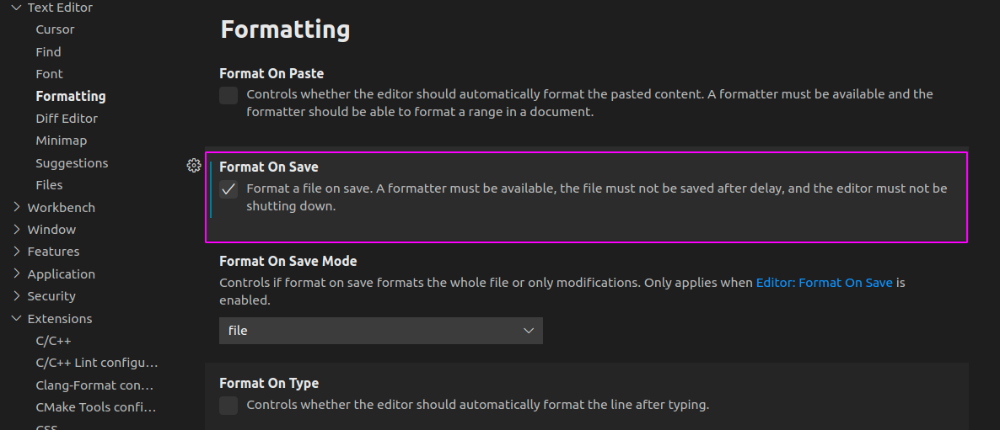


**git hook中添加**

目的是在git 中commit时，自动格式化提交改变的文件

在修改源码后，然后调用commit时，会自动调用clang-format对你修改的c++源码文件进行格式化, 如果是整个团队要用的话，可以.clang-format放在项目顶层目录中，然后写个脚本，

自动在每个用户的.git/hooks/中创建pre-commit文件，因为.git中的东西无法更新到远程项目中，所以需要显式地创建它。这样就能保证所有成员提交的代码格式是一致的

具体见https://blog.csdn.net/zmlovelx/article/details/105196415


vscode插件1  **C-family Documentation Comments**

​		该插件用于规范添加**文件头注释**以及**函数注释**，安装插件后(附件AlexCoderCorp.comments-1.0.4.vsix)，在VSCode的设置文件settings.json中添加附件(settings.json)中的内容，之后每次创建新的文件就会自动在文件起始处添加注释，当光标在函数上时，按快捷键(快捷键需要自己设置)就可以对函数添加注释，目前的注释格式如下：

文件头注释

```cpp
/*** 
 \* @(c) Copyright Xiamen Tung Thih Electron CO.,LTD.
 \* @FilePath   : /src/VSLAM/VSLAMSaveData.h
 \* @Author    : Longxi Li
 \* @Date     : 2020-03-24 13:59:14
 \* @Address   : No.26 Hua_Sheng RD. Huli District. Xiamen. China.
 \* @Mail     : [bj.wang@tungthih.com.cn](mailto:bj.wang@tungthih.com.cn)
 \* @LastEditors: Baojie Wang
 \* @LastEditTime: 2020-03-28 15:03:34
 \* @Description : 
 */
```

函数注释

```cpp
/*** 
\* @description: 
\* @param : 
\* @return : 
*/
```


### Valgrind内存检测工具


**安装**

https://blog.csdn.net/qq_15560431/article/details/109671419

1. 命令安装

```
sudo apt-get install valgrind
```


2. 源码安装

源码下载地址：https://www.valgrind.org/downloads/current.html

```
2、tar -jxvf valgrind-3.15.0.tar.bz2.tar.bz2
3、cd valgrind-3.15.0
4、sudo ./configure
5、sudo make
6、sudo make install
7、sudo /etc/profile.d/valgrind.sh
```

**测试查看版本**

```
valgrind --version
```


**官方使用手册**

https://www.valgrind.org/docs/manual/manual.html

https://www.xitongjiaocheng.com/ubuntu/2018/64582.html

1. 用vim编辑输入下列程序test.c

```c
#include <stdio.h>
void foo()
{
	int *arr=(int *)malloc(10*sizeof(int));
	arr[10];
}
int main()
{
	foo();
	return 0;
}
```

2. 编译程序

```
gcc -g test.c -o test
```

-g可以包括调试信息以至于Memcheck可以显示错误信息的正确行号。

3. 在Memcheck下运行程序

```
valgrind --leak-check=yes ./test
```


4. 程序修正

```c
#include <stdio.h>
void foo()
{
	int *arr=(int *)malloc(10*sizeof(int));
	arr[9]=0;
	free(arr);
}
int main()
{
	foo();
	return 0;
}
```


### Doxygen

ps. 为统一注释风格，采用统一提供的Doxyfile配置文件

​		Doxygen是一个程序的文档产生工具，可以将程序中的注释转换成说明文档或者说是API参考手册，从而减少程序员整理文档的时间。当然这里程序中的注释需要遵循一定的规则书写，才能让Doxygen识别和转化。

​		目前Doxygen可处理的程序语言包含C/C++、Java、Objective-C、IDL等，可产生出来的文档格式有HTML、XML、LaTeX、RTF等，此外还可衍生出不少其它格式，如HTML可以打包成CHM格式，而LaTeX可以通过一些工具产生出PS或是PDF文档等。

**vscode中插件的安装**

​		VSCode中的doxygen插件Doxygen Documentation Generator，在VSCode中使用该插件，可以帮助你更加方便的使用doxygen方式进行注释

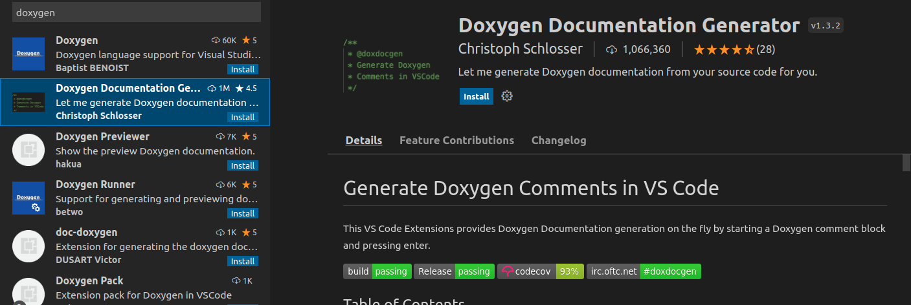

​		注释模版配置，File–Preferences–Settings-- 中打开**用户 setting.json文件** （~./config/Code/User/setting.json）

```json
{
    // Doxygen documentation generator set
    // 文件注释：版权信息模板
    "doxdocgen.file.copyrightTag": [
        "@copyright Copyright (c) {year} Xiamen Tung Thih Electron CO.,LTD"
    ],
    // 文件注释：自定义模块，这里我添加一个修改日志
    "doxdocgen.file.customTag": [
        "@par History:",
        "<table>",
    //    "<tr><th>Date       <th>Version <th>Author    <th>Description",
    //    "<tr><td>{date} <td>1.0     <td>sj.su     <td>内容",
        "<tr>",
        "    <th>Date",
        "    <th>Version",
        "    <th>Author",
        "    <th>Description",
       "</tr>",
       "<tr>",
        "    <th>{date}",
        "    <th>v0.0.1",
        "    <th>{author}",
        "    <th>原型开发",
        "</tr>",
        "</table>",
    ],
    // 文件注释的组成及其排序
    "doxdocgen.file.fileOrder": [
        "file",		// @file
        "brief",	// @brief 简介
        "author",	// 作者
        "version",	// 版本
        "date",		// 日期
        "empty",	// 空行
        "copyright",// 版权
        "empty",
        "custom"	// 自定义
    ],
    // 下面时设置上面标签tag的具体信息
    "doxdocgen.file.fileTemplate": "@file {name}",
    "doxdocgen.file.versionTag": "@version 1.0",
    "doxdocgen.generic.authorEmail": "sj.su@tungthih.com.cn",
    "doxdocgen.generic.authorName": "sj.su",
    "doxdocgen.generic.authorTag": "@author {author} ({email})",
    // 日期格式与模板
    "doxdocgen.generic.dateFormat": "YYYY-MM-DD",
    "doxdocgen.generic.dateTemplate": "@date {date}",
	
    // 根据自动生成的注释模板（目前主要体现在函数注释上）
    "doxdocgen.generic.order": [
        "brief",
        "tparam",
        "param",
        "return"
    ],
    "doxdocgen.generic.paramTemplate": "@param{indent:8}{param}{indent:25}My Param doc",
    "doxdocgen.generic.returnTemplate": "@return {type} ",
    "doxdocgen.generic.splitCasingSmartText": true,
}
```


**vscode中插件的使用**

​		使用方法: 在要注释的函数声明上一行, 输入"/**", 然后回车, 就可以自动生成函数参数列表供补充填写, 同时要自定义参数的时候可以在插件扩展中找到Param Template一项修改, 例如"@param[in] {param}", 然后根据函数形参输入或输出, 修改其中的in or out．


示例：


上面测试文件编码之后，点击保存，自动调整如下，并检测静态错误


## Git使用教程

Git教程：https://www.runoob.com/git/git-tutorial.html

廖雪峰： https://www.liaoxuefeng.com/wiki/896043488029600

Git 完整命令手册地址(官网)：http://git-scm.com/docs

PDF 版命令手册：[github-git-cheat-sheet.pdf](https://www.runoob.com/manual/github-git-cheat-sheet.pdf)

### 安装与配置

**安装**

​		Debian/Ubuntu Git 安装命令为：

```shell
$ apt-get install git			# 安装
$ git --version					# 查看版本
```


**配置**

Git 提供了一个叫做 git config 的工具，专门用来配置或读取相应的工作环境变量。

这些环境变量，决定了 Git 在各个环节的具体工作方式和行为。这些变量可以存放在以下三个不同的地方：

- `/etc/gitconfig` 文件：系统中对所有用户都普遍适用的配置。若使用 `git config` 时用 `--system` 选项，读写的就是这个文件。

- `~/.gitconfig` 文件：用户目录下的配置文件只适用于该用户。若使用 `git config` 时用 `--global` 选项，读写的就是这个文件。

- 当前项目的 Git 目录中的配置文件（也就是工作目录中的 `.git/config` 文件）：这里的配置仅仅针对当前项目有效。每一个级别的配置都会覆盖上层的相同配置，所以 `.git/config` 里的配置会覆盖 `/etc/gitconfig` 中的同名变量。

    

```shell
$ git config --global user.name "runoob"				# 配置个人的用户名称
$ git config --global user.email test@runoob.com		# 配置个人的电子邮件
$ git config --list										# 查看配置信息, 重复的变量名，那就说明它们来自不同的配置文件（比如 /etc/gitconfig 和 ~/.gitconfig），不过最终 Git 实际采用的是最后一个
```

如果用了 **--global** 选项，那么更改的配置文件就是位于你用户主目录下的那个，以后你所有的项目都会默认使用这里配置的用户信息。

如果要在某个特定的项目中使用其他名字或者电邮，只要去掉 --global 选项重新配置即可，新的设定保存在当前项目的 .git/config 文件里。


### 工作区和缓存区

先来理解下 Git 工作区、暂存区和版本库概念：

- **工作区：**就是你在电脑里能看到的目录。
- **暂存区：**英文叫 stage 或 index。一般存放在 **.git** 目录下的 index 文件（.git/index）中，所以我们把暂存区有时也叫作索引（index）。
- **版本库：**工作区有一个隐藏目录 **.git**，这个不算工作区，而是 Git 的版本库。

下面这个图展示了工作区、版本库中的暂存区和版本库之间的关系：


- 图中左侧为工作区，右侧为版本库。在版本库中标记为 "index" 的区域是暂存区（stage/index），标记为 "master" 的是 master 分支所代表的目录树。
- 图中我们可以看出此时 "HEAD" 实际是指向 master 分支的一个"游标"。所以图示的命令中出现 HEAD 的地方可以用 master 来替换。
- 图中的 objects 标识的区域为 Git 的对象库，实际位于 ".git/objects" 目录下，里面包含了创建的各种对象及内容。
- 当对工作区修改（或新增）的文件执行 **git add** 命令时，暂存区的目录树被更新，同时工作区修改（或新增）的文件内容被写入到对象库中的一个新的对象中，而该对象的ID被记录在暂存区的文件索引中。
- 当执行提交操作（git commit）时，暂存区的目录树写到版本库（对象库）中，master 分支会做相应的更新。即 master 指向的目录树就是提交时暂存区的目录树。
- 当执行 **git reset HEAD** 命令时，暂存区的目录树会被重写，被 master 分支指向的目录树所替换，但是工作区不受影响。
- 当执行 **git rm --cached <file>** 命令时，会直接从暂存区删除文件，工作区则不做出改变。
- 当执行 **git checkout .** 或者 **git checkout -- <file>** 命令时，会用暂存区全部或指定的文件替换工作区的文件。这个操作很危险，会清除工作区中未添加到暂存区中的改动。
- 当执行 **git checkout HEAD .** 或者 **git checkout HEAD <file>** 命令时，会用 HEAD 指向的 master 分支中的全部或者部分文件替换暂存区和以及工作区中的文件。这个命令也是极具危险性的，因为不但会清除工作区中未提交的改动，也会清除暂存区中未提交的改动。

图解举例：

​		把文件往Git版本库里添加的时候，是分两步执行的：

​		第一步是用`git add`把文件添加进去，实际上就是把文件修改添加到暂存区；

```shell
git add readme.txt LICENSE				# 
```


​		第二步是用`git commit`提交更改，实际上就是把暂存区的所有内容提交到当前分支。

```shell
git commit -m 'understand how stage works'		
```


git add和git commit命令使用示例：

```shell
git add <file1> <file2> ...				# 添加一个或多个文件到暂存区
git add <dir>							# 添加指定目录到暂存区，包括子目录
git add .								# 添加当前目录下的所有文件到暂存区

git commit -m <comment>					# 将暂存区内容添加到本地仓库中
git commit -am <comment>				# -a参数设置修改文件后不需要执行 git add 命令, 即无须预先使用git add .命令

git status								# 命令用于查看在你上次提交之后是否有对文件进行再次修改
git status -s							# 使用 -s 参数来获得简短的输出结果
```


### 基本操作

​		Git 的工作就是创建和保存你项目的快照及与之后的快照进行对比。Git 常用的是以下 6 个命令：git clone、git push、git add 、git commit、git checkout、git pull。


说明：

- workspace：工作区
- staging area：暂存区/缓存区
- local repository：版本库或本地仓库
- remote repository：远程仓库


**版本回退**

git reset语法格式：

```shell
git reset [--soft | --mixed | --hard] [HEAD | commit-id] ([file])
```

--mixed参数：默认，用于重置暂存区的文件与上一次的提交(commit)保持一致，工作区文件内容保持不变。

--soft参数：

--hard参数：撤销工作区中所有未提交的修改内容，将暂存区与工作区都回到上一次版本，并删除之前的所有信息提交

HEAD 参数说明：

- HEAD 表示当前版本;  HEAD^ 上一个版本;  HEAD^^ 上上一个版本; 以此类推...

- HEAD~0 表示当前版本; HEAD~1 上一个版本; HEAD^2 上上一个版本; 以此类推...

示例：

```shell
git log 							# 查看提交历史, 以便确定要回退到哪个版本; --pretty=oneline参数使能精简显示
git reflog							# 查看命令历史，以便确定要回到未来的哪个版本
git reset HEAD						# 取消已缓存的内容
git reset HEAD^						# 回退暂存区所有内容到上一个版本
git reset HEAD^ <file>				# 回退暂存区file文件到上一个版本
git reset --hard HEAD^				# 回退暂存区和工作区所有内容到上一个版本
git reset --hard <commit-id>		# 回退暂存区和工作区所有内容到指定commit-id版本，commit-id可以是过去，也可以是未来
git reset --hard origin/master   	# 将本地的状态回退到和远程的一样 
```


**修改对比**

```shell
git status							# 查看仓库当前的状态，显示有变更的文件(文件级别)
git diff <file>						# 显示工作区与暂存区的差异（行级别）
git diff --cached <file>	        # 显示暂存区与最新一次提交(commit)的差异，其中--cached可以替换成--staged
git diff HEAD <file>				# 显示工作区与最新一次提交(commit)的差异
git diff <commid-id1> <commit-id2>	# 显示两次提交之间的差异

```


**撤销修改**

```shell
git checkout -- <file>				# 把工作区的修改撤销掉,优先根据缓冲区中的文件，其次再根据版本库中的文件来撤销
git reset HEAD <file>				# 把暂存区的修改撤销掉（unstage），相当于撤销git add <file>的操作
git rm --cached <file>				# 把暂存区的修改撤销掉（unstage），相当于撤销git add <file>的操作
```

git checkout -- <file>有两种情况：

一种是`readme.txt`自修改后还没有被放到暂存区，现在，撤销修改就回到和版本库一模一样的状态；

一种是`readme.txt`已经添加到暂存区后，又作了修改，现在，撤销修改就回到添加到暂存区后的状态。


**删除文件**

```shell
rm <file>							# 手动删除工作区的文件<file>
git add/rm <file>					# 添加变更到暂存区(删除文件也是一种变更)
git commit -m 'comment'				# 提交变更

git rm <file>						# 删除工作区和暂存区的文件<file>
git commit -m 'comment'				# 提交变更
```


**移动或重命名文件**

```shell
mv <file> <newfile>					# 手动重命令，git视为两个操作，一个是删除原文件file，另一个是新建文件newfile，这种方式不方便跟踪回退

git mv <file> <newfile>				# 移动或重命名一个文件、目录或软连接
git mv -f <file> <newfile>			# 如果新文件名已经存在，但还是要重命名它，使用 -f 参数
```


### 分支管理

​		初始化一个Git仓库时，会自动创建默认的`master`分支，`master`分支是一条线，Git用`master`指向最新的提交，再用`HEAD`指向`master`，每次提交，`master`分支都会向前移动一步，这样，随着你不断提交，`master`分支的线也越来越长。`HEAD`指向的就是当前分支，通过`HEAD`就能确定当前分支，以及当前分支的提交点。


​		创建并切换分支dev


​		新增一次提交，`dev`指针往前移动一步，而`master`指针不变


​	把`dev`合并到`master`上，最简单的方法，就是直接把`master`指向`dev`的当前提交，就完成了合并(fast-forward模式)


fast-forward模式


非fast-forward模式

​	删除`dev`分支，就是把`dev`指针给删掉，删掉后，我们就剩下了一条`master`分支


**分支管理基本命令**

```shell
git branch						# 列出分支
git branch <branch-name>		# 创建分支
git branch -d <branch-name>		# 删除分支
git checkout <branch-name>		# 切换分支
git checkout -b <branch-name> 	# 创建+切换到分支<branch-name>, 相当于两条命令
git switch <branch-name>		# 切换分支（新版本命令）
git switch -c <branch-name>		# 创建+切换分支（新版本命令）
git merge <branch-name>			# 将<branch-name>分支合并到当前分支, 用git branch查看当前分支(fast-forward模式)
git merge --no-ff -m "merge with no-ff" dev		# 将<branch-name>分支合并到当前分支, 其中--no-ff参数，表示禁用Fast forward;
												# 因为本次合并要创建一个新的commit，加上-m参数，把commit描述写进去
```


**合并冲突处理**

场景：`master`分支和`feature1`分支各自都分别有新的提交，变成如下图所示的情况。这种情况下，合并分支很可能会有冲突，Git无法执行“快速合并”


示例: readme.txt原始内容为`Creating a new branch`

```shell
vim readme.txt					# 在master分支上修改readme.txt文件 Creating a new branch is quick & simple
git add readme.txt 				
git commit -m "& simple"		# 在master分支上提交修改

git branch feature1				# 创建feature1分支
git checkout feature1			# 切换到feature1分支
vim readme.txt					# 在feature1分支上修改readme.txt文件 Creating a new branch is quick AND simple
git add readme.txt				# 
git commit -m 'AND simple'		# 在feature1分支上提交修改

git checkout master				# 切换到master分支
git merge feature1				# 合并feature1分支到当前master分支，此时会出现冲突提示
```


处理： 解决冲突就是把Git合并失败的文件手动编辑为我们希望的内容，再提交


示例：

```shell
git status							# 查看冲突具体详情
vim readme.txt						# 手动修改冲突文件
git add readme.txt 					# 标识冲突已解决
git commit -m "conflict fixed"		# 提交
git log --graph --pretty=oneline --abbrev-commit		# 查看分支的合并情况
```


**分支管理策略**

​		在实际开发中，我们应该按照几个基本原则进行分支管理：

首先，`master`分支应该是非常稳定的，也就是仅用来发布新版本，平时不能在上面干活；

那在哪干活呢？干活都在`dev`分支上，也就是说，`dev`分支是不稳定的，到某个时候，比如1.0版本发布时，再把`dev`分支合并到`master`上，在`master`分支发布1.0版本；

你和你的小伙伴们每个人都在`dev`分支上干活，每个人都有自己的分支，时不时地往`dev`分支上合并就可以了。

所以，团队合作的分支看起来就像这样：


### 远程仓库

**添加远程库** 

```shell
git remote add origin <git@server-name:path/repo-name.git>	# 关联一个远程库, origin是远程库名, 
git remote rm origin
git clone <repo> (<directory>)			# 克隆Git仓库到指定的目录, 不指定directory时默认为当前目录
```


**查看远程库信息**

```shell
git remote			# 远程仓库的名称默认为origin
git remote -v		# 显示抓取fetch和推送push的origin地址
```


**抓取分支**

方式一：git fetch抓取分支

```shell
git fetch origin					# 下载远程库代码
git merge origin/master				# 合并远程分支origin/master到当前分支
```

方式二：git pull抓取分支

​		`git pull` 命令用于从远程获取代码并合并本地的版本。git pull其实就是git fetch 和 git merge FETCH_HEAD 的简写。 命令格式如下：

```shell
git pull <远程主机名> <远程分支名>:<本地分支名>
```

示例：

```shell
git pull											# 抓取远程分支
git pull origin
git pull origin master:branchtest					# 将远程主机origin的master分支拉取过来，与本地brantest分支合并
git pull origin master								# 将远程主机origin的master分支拉取过来，与本地当前分支合并(当前分支，冒号后面的部分省略)
```

​		从远程库clone时，默认情况下，只能看到本地的`master`分支，`git branch`查看验证，因此需要如下操作

```shell
git checkout -b dev origin/dev						# 在本地创建和远程分支origin/dev对应的分支
git branch --set-upstream-to=origin/dev dev			# 建立本地分支dev与远程分支origin/dev的关联
```


**推送分支**

```shell
git push origin master		# 将master分支推送到远程库对应的远程分支上，并合并
git push origin dev			# 将dev分支推送到远程分支，并合并
git push -u origin master   # 第一次推送master分支时，加上了-u参数，Git不但会把本地的master分支内容推送的远程新的master分支，还会把本地的master分支和远程的master分支关联起来
```


**示例：将本地代码上传到github**

第一步：建立git仓库，cd到你的本地项目根目录下，执行git命令

```text
git init
```

第二步：将项目的所有文件添加到仓库中

```c
git add .
```

第三步：将add的文件commit到仓库

```text
git commit -m "注释语句"
```

第四步：去github上创建自己的Repository，获取地址[git@github.com](mailto:git@github.com):\**\*/test.git**，记得要用SSH的地址，尽量不要用HTTPS的地址

第五步：将本地的仓库关联到github上---把上一步复制的地址放到下面

```text
git remote add origin git@github.com:***/test.git
```

第六步：上传github之前，要先pull一下，执行如下命令：

```text
git pull origin master
```

第七步，上传代码到github远程仓库

```text
git push -u origin master
```


**多人协作的工作模式通常是这样**

1. 首先，可以试图用`git push origin <branch-name>`推送自己的修改；
2. 如果推送失败，则因为远程分支比你的本地更新，需要先用`git pull`试图合并；
3. 如果合并有冲突，则解决冲突，并在本地提交；
4. 没有冲突或者解决掉冲突后，再用`git push origin <branch-name>`推送就能成功！

如果`git pull`提示`no tracking information`，则说明本地分支和远程分支的链接关系没有创建，用命令`git branch --set-upstream-to <branch-name> origin/<branch-name>`。


**github/gitee远程仓库配置**

第1步：创建SSH Key，在.ssh目录下生成`id_rsa`和`id_rsa.pub`这两个文件

```shell
ssh-keygen -t rsa -C "youremail@example.com"		# 无需设置密码, 一路回车即可
```

第2步：登陆GitHub，打开“Account settings”，“SSH Keys”页面添加`id_rsa.pub`文件的内容


### 标签管理

​		标签总是和某个commit挂钩。如果这个commit既出现在master分支，又出现在dev分支，那么在这两个分支上都可以看到这个标签。

**创建标签**

```shell
git tag <tag-name>				# 在最新提交的commit上创建标签(默认)
git tag							# 查看所有标签
git tag <tag-name> <commit-id>	# 在指定的commit-id上创建标签,查看历史commit-id的命令git log --pretty=oneline --abbrev-commit
git show <tag-name>				# 查看标签具体信息
git tag -a v0.1 -m "version 0.1 released" 1094adb	# 创建带有说明的标签，用-a指定标签名，-m指定说明文字
```


**操作标签**

```shell
git tag -d <tag-name>					# 删除标签
git push origin <tagname>				# 推送某个标签到远程
git push origin --tags					# 一次性推送全部尚未推送到远程的本地标签
git push origin :refs/tags/<tag-name>	# 可以删除一个远程标签
```


### 忽略特殊文件

​		有些时候，你必须把某些文件放到Git工作目录中，但又不能提交它们，比如保存了数据库密码的配置文件啦，等等

- 忽略某些文件时，在工作目录下编写`.gitignore`；
- `.gitignore`文件本身要放到版本库里，并且可以对`.gitignore`做版本管理！

GitHub已经为我们准备了各种配置文件，只需要组合一下就可以使用了。所有配置文件可以直接在线浏览：https://github.com/github/gitignore

如对于C++的配置文件：

```shell
# Prerequisites
*.d

# Compiled Object files
*.slo
*.lo
*.o
*.obj

# Precompiled Headers
*.gch
*.pch

# Compiled Dynamic libraries
*.so
*.dylib
*.dll

# Fortran module files
*.mod
*.smod

# Compiled Static libraries
*.lai
*.la
*.a
*.lib

# Executables
*.exe
*.out
*.app
```


自定义`.gitignore` (Windows下进行Python开发)：

```shell
# Windows系统自动生成的文件:
Thumbs.db
ehthumbs.db
Desktop.ini			

# Python编译生成的中间文件、可执行文件等:
*.py[cod]
*.so
*.egg
*.egg-info
dist
build

# My configurations自己的带有敏感信息的配置文件:
db.ini
deploy_key_rsa

# 不排除.gitignore和App.class:
!.gitignore
!App.class
```

检验`.gitignore`的标准是`git status`命令是不是说`working directory clean`


### vscode插件-GitLens


## AVM_SLAM


### 基本知识点


#### [向量点乘与叉乘](https://www.cnblogs.com/zhoug2020/p/7508722.html)

**向量（Vector）**
		在几乎所有的几何问题中，向量（有时也称矢量）是一个基本点。向量的定义包含方向和一个数（长度）。在二维空间中，一个向量可以用一对x和y来表示。例如由点(1, 3)到(5, 1)的向量可以用(4, -2)来表示。这里大家要特别注意，我这样说并不代表向量定义了起点和终点。向量仅仅定义方向和长度。

向量加法
   向量也支持各种数学运算。最简单的就是加法。我们可以对两个向量相加，得到的仍然是一个向量。我们有：
$$
V_1(x_1, y_1)+ V_2(x_2, y_2) = V_3(x_1+x_2, y_1+y_2)
$$

   下图表示了四个向量相加。注意就像普通的加法一样,相加的次序对结果没有影响（满足交换律），减法也是一样的。

**点乘（Dot Product）**
   如果说加法是凭直觉就可以知道的，另外还有一些运算就不是那么明显的，比如点乘和叉乘。
   点乘比较简单，是相应元素的乘积的和：
$$
V_1(x_1, y_1) \cdot V_2(x_2, y_2) = x_1*x_2 + y_1*y_2
$$
​    注意结果不是一个向量，而是一个标量（Scalar）。点乘有什么用呢，我们有：
$$
A \cdot B = |A| \cdot |B|cos(θ)
$$

​      θ是向量A和向量B见的**夹角**。这里|A|我们称为向量A的模(norm)，也就是A的长度， 在二维空间中就是|A| = sqrt(x2+y2)。这样我们就和容易计算两条线的**夹角**：  Cos(θ) = AB /(|A||B|)

   当然你知道要用一下反余弦函数acos()啦。（回忆一下cos(90)=0 和cos(0) = 1还是有好处的，希望你没有忘记。）这可以告诉我们如果点乘的结果，简称点积，为0的话就表示这两个向量垂直。当两向量平行时，点积有最大值
   另外，点乘运算不仅限于2维空间，他可以推广到任意维空间。（译注：不少人对量子力学中的高维空间无法理解，其实如果你不要试图在视觉上想象高维空间，而仅仅把它看成三维空间在数学上的推广，那么就好理解了）

**叉乘（cross product）**
   相对于点乘，叉乘可能更有用吧。2维空间中的叉乘是：
$$
V_1(x_1, y_1) \times V_2(x_2, y_2) = x_1*y_2 – y_1*x_2
$$
   看起来像个标量，事实上叉乘的结果是个向量，方向在z轴上。上述结果是它的模。在二维空间里，让我们暂时忽略它的方向，将结果看成一个向量，那么这个结果类似于上述的点积，我们有：
$$
A \cdot B = |A| \cdot |B|sin(θ)
$$
   然而角度 θ和上面点乘的角度有一点点不同，**他是有正负的，是指从A到B的角度**。A到B的角度在0-180度范围时，结果为正，在180～360范围时，结果为负。因此 ，向量的外积不遵守乘法交换率，因为向量a×向量b=-向量b×向量a在物理学中，已知力与力臂求外积，就是向量的外积，即叉乘。

   向量c的方向与a,b所在的平面垂直，且方向要用“右手法则”判断。判断方法如下：

1.右手手掌张开，四指并拢，大拇指垂直于四指指向的方向；

2.伸出右手，四指弯曲，四指与A旋转到B方向一致，那么大拇指指向为C向量的方向。

                    

   另外还有一个有用的特征那就是叉积的绝对值就是A和B为两边说形成的**平行四边形的面积**。也就是AB所包围三角形面积的两倍。在计算面积时，我们要经常用到叉积。


（译注：三维及以上的叉乘参看维基：http://en.wikipedia.org/wiki/Cross_product）

**点-线距离**
   找出一个点和一条线间的距离是经常遇见的几何问题之一。假设给出三个点，A，B和C，你想找出点C到点A、B定出的直线间距离。第一步是找出A到B的向量AB和A到C的向量AC，现在我们用该两向量的叉积除以|AB|，这就是我们要找的的距离了（下图中的红线）。
  d = (AB x AC)/|AB| 

   如果你有基础的高中几何知识，你就知道原因了。上一节我们知道(AB X AC)/2是三角形ABC的面积，这个三角形的底是|AB|，高就是C到AB的距离。有时叉积得到的是一个负值，这种情况下距离就是上述结果的绝对值。
   当我们要找点到线段的距离时，情况变得稍稍复杂一些。这时线段与点的最短距离可能是点到线段的某一端点，而不是点到直线的垂线。例如上图中点C到线段AB的最短距离应该是线段BC。我们有集中不同的方法来判断这种特殊情况。第一种情况是计算点积AB B来判定两线段间**夹角**。如果点积大于等于零，那么表示AB到BC是在-90到90度间，也就是说C到AB的垂线在AB外，那么AB上到C距离最近的点就是B。同样，如果BAAC大于等于零，那么点A就是距离C最近的点。如果两者均小于零，那么距离最近的点就在线段AB中的莫一点。


#### Eigen矩阵库

一个模板函数，用于将一串数据映射到一个矩阵或者向量中。

模板是

```cpp
template<typename PlainObjectType, int MapOptions, typename StrideType>
class Eigen::Map< PlainObjectType, MapOptions, StrideType >
```

PlainObjectType：指定想要生成的矩阵或者向量的类型，比如Matrix3i，VectorXi，RowVectorXi

MapOptions：以字节为单位指定指针对齐方式，可以为Aligned8，Aligned16....

StrideType：指定“步幅”的种类，可以为外部或者内部，分别为OuterStride或者InnerStride，默认为是连续的，也就是没有步幅。所谓的OuterStride指的是，如果我们构造的矩阵为列优先（column-major），那么每两个连续的列之间的指针就会跳跃一个步幅，如果为InnerStride，那么矩阵或者向量内部每两个连续的元素之间就会跳跃一个步幅。

Map有三种构造函数：    

```cpp
Map (PointerArgType dataPtr, const StrideType &stride=StrideType())
Map (PointerArgType dataPtr, Index size, const StrideType &stride=StrideType())
Map (PointerArgType dataPtr, Index rows, Index cols, const StrideType &stride=StrideType())
```

dataPtr：指向数据的指针

StrideType：步幅的类型

size：用于构造向量时指定大小

rows，cols：几行几列

下面看例程：

```cpp
int array[9];
for(int i = 0; i < 9; ++i) array[i] = i;
cout << Map<Matrix3i>(array) << endl;

```

输出：

```
output：
0 3 6
1 4 7
2 5 8
```


带StrideType的：

```cpp
int array[12];
for(int i = 0; i < 12; ++i) array[i] = i;
cout << Map<VectorXi, 0, InnerStride<2> >
         (array, 6) // the inner stride has already been passed as template parameter
     << endl;
```

输出：

```
 0
 2
 4
 6
 8
10
```


```
int array[12];
for(int i = 0; i < 12; ++i) array[i] = i;
cout << Map<MatrixXi, 0, OuterStride<> >(array, 3, 3, OuterStride<>(4)) << endl;
 
output：
 0  4  8
 1  5  9
 2  6 10
```


#### Ceres Solver最优化库

官网文档：http://ceres-solver.org/nnls_modeling.html#sizedcostfunction


无约束最优化问题


https://blog.csdn.net/qq_34420188/article/details/76083106

Rosenbrock函数描述

https://www.docin.com/p-1039869305.html


#### 流形空间

> **目录**
>
> 1. 什么是流形
>
> 2. 流形有什么用
>
> 3. 如何证明模型学习到了流形
>
> 4. 流形学习的关键

**1. 什么是流形**

1. 两个例子：

    现在我们想表示一个圆，

    - 在平面直角坐标系中，这个圆可以被一个二维点集{(x,y)| x^2 + y^2 <=R^2}表示。所以圆是二维的object
    - 在极坐标系中，这个圆可以这样表示：圆心在原点，然后给定半径R。所以圆是一维的object
    - 上述描述可以画个两个图(更加形象，有助于理解)

2. 流形的定义：

    - 流形学习的一个观点：任何现实世界中的object均可以看做是**低维流形**在**高维空间**的**嵌入**(嵌入可以理解为表达)，举例说：圆是**一维流形**在**二维空间**的嵌入，球是二维流形在三维空间的嵌入（三维坐标系中的球可以用二维的经纬度来表达）

        > 流形学习的观点是认为，我们所能观察到的数据实际上是由一个低维流形映射到高维空间上的。由于数据内部特征的限制，一些高维中的数据会产生维度上的冗余，实际上只需要比较低的维度就能唯一地表示。

    - 我**个人**的感觉：这个好像是个拓扑变换的感觉，你看到的是高维的数据点，但是可以借助一些拓扑变换，转化为低维的表达(但是这种低维表达要确保某些“合理性”)

**2. 流形有什么用**

1. outline

    - 数据非线性降维
    - 刻画数据的本质

2. 流形用于数据降维

    > 高维空间有冗余，低维空间没冗余。也就是说，流形可以作为一种数据降维的方式。传统很多降维算法都是用欧氏距离作为评价两个点之间的距离函数的。但是仔细想想这种欧氏距离直觉上并不靠谱。“我们只是看到了三维数据，就要用三维坐标系内的尺度去对事物进行评价？”总觉得有些怪怪的。

    举例来说：

    - 你要测量从广州到深圳的距离，有两种做法：（1）基于已有的经纬度地图体系，拿个卷尺到地球仪 上固定两点做个测量；（2）构建关于地球的三维坐标系，在地球上这两点之间打洞连个直线测量。现任正常人都是选择第一种方案。
    - 再比如我们想基于距离对广东省内所有小城市进行聚类，聚合形成几个超大城市，这个时候你用的距离当然是**地表距离**（用**经纬度体系**构建的二维地图来计算距离），而不会说要根据**三维**坐标系下的两点之间的**欧氏距离**
    - 而对于降维算法来说，如果使用传统的欧氏距离来作为距离尺度，显然会抛弃“数据的**内部特征**”。举例说， 如果测量**球面**两点距离采用空间欧氏距离，那就会忽略掉“这是个球面”这个信息。（这两点不仅是**三维空间上**的点，而且还**同属于一个球面**，这个关键信息要利用起来）

    （最后来副周志华的西瓜书的图！）非线性降维因为考虑到了流形的问题，所以降维的过程中不但考虑到了距 离，更考虑到了生成数据的拓扑结构。

3. 刻画数据的本质：

    > 既然学习到了“将数据从高维空间降维到低维空间，还能不损失信息”的映射，那这个映射能够输入原始数据，输出数据更本质的特征(就像压缩一样，用更少的数据能尽可能多地表示原始数据)。
    >
    > 这方面也是深度学习一直在搞的事情。深度学习主要的特点就是“特征学习”，所谓特征，就是能“表示事物本质的内容”，一般来说特征的维度应该小于数据本身。有一些实证证实，大脑处理数据其实是通过记忆、重现的方式。数据那么多，大脑怎么能一一记住？那就可以只记住“特征”！例如我们知道“人”都是两只眼睛一个鼻子一张嘴。而具体到每一个人则是再这个基本特征之上添加了一些其他的特异性的内容仅此而已。
    >
    > 深度学习一直以来就是在模仿大脑的结构，或者说在模仿大脑对数据的处理能力：从底层感受器输入原始数据，逐步求精得到特征。

    深度学习中所谓的特征，在一定程度上就可以用流形的概念来解释。我们希望我们的模型能够学习到“数据在流型空间中的表示”。（流形空间相比原空间是**低维**的）如果能做到这一点，则说明我们的模型离“模拟大脑”又前进了一步。

**3. 如何证明模型学习到了流形**

1. 观测学习的过程：

    > 前面提到了高维数据其实是由低维流形生成的。如果我们能模拟这个生成过程，再通过对低维流形的微调，应该能得到对应的“有意义且有道理”的高维数据。

    - 下面是利用生成对抗网络（GAN）生成的人脸：

    

     如果对GAN不了解的话，就可以把生成过程看作：输入一个特征空间的**低维**编码，得到一个输出空间的

     **高维**图像。如何证明我们学习到的这个生成过程就是像人脑一样从**低维流形**映射到**高维空间**呢？还 记得

     我们之前说过，流型空间一般应该是**连续**的，而映射到的高维空间的数据也应该在**流形连续调整**时变得

     **连续且有意义**。

    - 再举个例子，再另一篇介绍了GAN的一个扩展的DCGAN的文章中，做了这样一件事：

        寻找两个编码，这两个编码都能生成有意义的内容，将这两个编码插值得到好多编码。也就是说这些编码实际上描述了从编码A到编码B缓慢转变的过程。编码A是起点，编码B是目标，A和B之间的连续转变的编码则应该让生成的图像处于“从A向B”的过渡过程！事实如何呢？请看下图：

    

**4. 流形学习的关键**

1. 如何找到这个**从高维到低维**的**映射**。
2. 哪怕不能直接找到这个映射，那我们可以找到**某种方法**实现一种**等价**：在高维空间处理数据，等效于: 将高维空间**映射到**低维空间、**再处理**数据、**再映射回**高维空间”的这种操作。


### 输入及预处理


### 核心建图


startpt


#### 坐标系

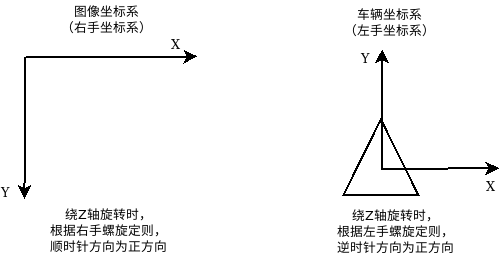


#### 损失函数

**2维情况**

平面上有一个点$p$在坐标系1上的坐标为$\vec{p_1}=(x_1, y_1)^T$，在坐标系2上的坐标为$\vec{p_2}=(x_2, y_2)^T$，坐标系1和坐标系2存在旋转平移关系

$$\vec{p_1}=R_{12}\cdot{\vec{p}_2}+\vec{t}_{12}$$

其中，$R_{12}$是旋转向量，指**把坐标系2的向量变换到坐标系1**，$\vec{t}_{12}$是平移向量，指“坐标系1原点指向坐标系2原点的向量”，即**坐标系2在坐标系1下取的坐标**。

进一步地，旋转向量$R_{12}=R(\theta)=\begin{bmatrix} cos(\theta) & -sin(\theta) \\ sin(\theta) & cos(\theta)\end{bmatrix}, \vec{t}_{12}=(t_x, t_y)$，将上式展开，可得
$$
\begin{bmatrix} x_1 \\ y_1 \end{bmatrix} 
=
\begin{bmatrix} cos(\theta) & -sin(\theta) \\ sin(\theta) & cos(\theta)\end{bmatrix}\cdot
\begin{bmatrix}x_2 \\ y_2 \end{bmatrix}+
\begin{bmatrix}t_x \\ t_y \end{bmatrix}
$$
坐标系2上的点变换到坐标系1上，写成代数式为
$$
x_1 = cos(\theta) \cdot x_2 - sin(\theta) \cdot y_2 + t_x \\
y_1 = sin(\theta) \cdot x_2 + cos(\theta) \cdot y_2 + t_y
$$
点$p$在坐标系1上的测量值为$(x_1^,,y_1^,)$，变换的点与测量值之间的残差为：
$$
E_x(t_x, t_y, \theta) = cos(\theta) \cdot x_2 - sin(\theta) \cdot y_2 + t_x - x_1^,\\
E_y(t_x, t_y, \theta) = sin(\theta) \cdot x_2 + cos(\theta) \cdot y_2 + t_y - y_1^,
$$
我们的目标是寻找一个最优的R和t，使得变换后的点与测量值之间误差尽可能的小，故目标函数定义为：
$$
E(t_x, t_y, \theta) = ||E_x(t_x, t_y, \theta)||^2 + ||E_y(t_x, t_y, \theta)||^2
$$


残差$E_x(t_x, t_y, \theta)$对优化变量$(t_x, t_y, \theta)$求偏导数
$$
\frac{\partial E_x(t_x, t_y, \theta)}{\partial t_x} = 1 \\
\frac{\partial E_x(t_x, t_y, \theta)}{\partial t_y} = 0 \\
\frac{\partial E_x(t_x, t_y, \theta)}{\partial \theta} = -sin(\theta) \cdot x_2 - cos(\theta) \cdot y_2
$$


残差$E_y(t_x, t_y, \theta)$对优化变量$(t_x, t_y, \theta)$求偏导数
$$
\frac{\partial E_y(t_x, t_y, \theta)}{\partial t_x} = 1 \\
\frac{\partial E_y(t_x, t_y, \theta)}{\partial t_y} = 0 \\
\frac{\partial E_y(t_x, t_y, \theta)}{\partial \theta} = cos(\theta) \cdot x_2 - sin(\theta) \cdot y_2
$$


#### 两坐标系变换关系

上述中坐标系2与坐标系1之间的变换关系$(t_{x12}, t_{y12}, \theta_{12})$，其中$R_{12}=R(\theta_{12})$要如何求解呢？

**问题1**：已知坐标系1在世界坐标系$\{w\}$上的位姿为$(t_{w1x}, t_{w1y}, \theta_{w1})$，坐标系2在世界坐标$\{w\}$上的位姿为$(t_{w2x}, t_{w2y}, \theta_{w2})$，求坐标系2相对于坐标系1的位姿$(\mathbf t_{12}, \theta_{12})$ 
$$
\theta_{12} = \theta_{w2} - \theta_{w1} \\
\mathbf t_{12} = \mathbf R_{w1}^T \cdot (\mathbf t_{w2} - \mathbf t_{w1})
$$
其中，
$$
\mathbf R_{w1} = \begin{bmatrix} cos(\theta_{w1}) & -sin(\theta_{w1}) \\ sin(\theta_{w1}) & cos(\theta_{w1}) \end{bmatrix} \\
$$
另有：
$$
\mathbf R_{w1}^T = \begin{bmatrix} cos(\theta_{w1}) & sin(\theta_{w1}) \\ -sin(\theta_{w1}) & cos(\theta_{w1}) \end{bmatrix}
$$


**问题2**：已知平面上某一向量$\mathbf p$在坐标系1上的位姿为$(\mathbf t_1, \theta_{1})$，在坐标系2上的位姿为$(\mathbf t_{2}, \theta_2)$，**同一个点在不同坐标系下**，求坐标系2相对于坐标1的位姿$(\mathbf t_{12}, \theta_{12})$

坐标转换示意图：

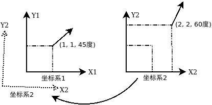


$$
\theta_{12} = \theta_1 - \theta_2 \\
\mathbf t_{12} = \mathbf t_1 - \mathbf R(\theta_{12})  \cdot \mathbf t_2
$$
其中
$$
\mathbf R(\theta_{12}) = \begin{bmatrix} cos(\theta_{12}) & -sin(\theta_{12}) \\ sin(\theta_{12}) & cos(\theta_{12}) \end{bmatrix}
$$
公式理解： $\mathbf R(\theta_{12})  \cdot \mathbf t_2$ 先把坐标系2下的点变换到坐标系上


**去一维约束**


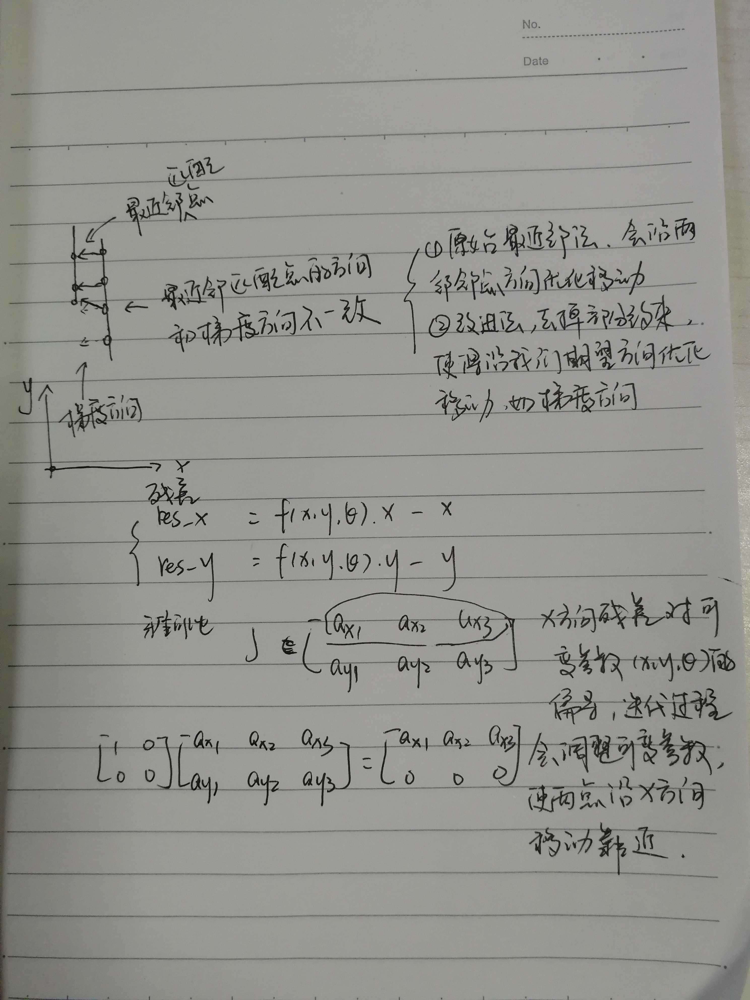


### 矢量化


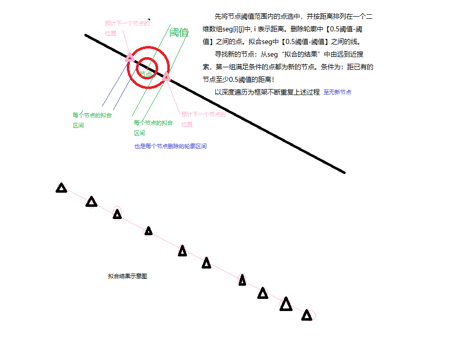


### 待改进之处

.h和.cpp

坐标系

地图

现有：在建图过程中，经常涉及图像坐标系与世界坐标系的转换

数据预处理部分，做好图像数据的坐标转换，转换到统一，设定地图坐标系统的原点


$$
G'x= \begin{bmatrix} {1} & {0} \\ {0} & {-1} \end{bmatrix} \\
G'y= \begin{bmatrix} {0} & {1} \\ {-1} & {0} \end{bmatrix}
$$

$$
{G_x}'= \begin{bmatrix} {-1} & {0} & {1} \\ {-2} & {0} &{2} \\ {-1} & {0} & {1} \end{bmatrix} \\
{G_y}'= \begin{bmatrix} {1} & {2} & {1} \\ {0} & {0} &{0} \\ {-1} & {-2} & {-1} \end{bmatrix}
$$


## 梯度、散度、旋度、Jacobian、Hessian、Laplacian 的关系图

参考：https://zhuanlan.zhihu.com/p/35323714

### 一、入门


　　图中的细实线箭头表示了四种一阶微分运算，包括梯度、散度、旋度和 Jacobian。每条箭头的起点表示了相应运算的自变量的类型，终点表示了相应运算的因变量的类型，例如梯度运算是作用在标量上的，结果是向量。图中的「向量」默认为列向量。

　　这四种一阶微分运算可以统一用算符 ![[公式]](https://www.zhihu.com/equation?tex=%5Cnabla) （读作 nabla）表示。Nabla 算符是一个形式向量 ![[公式]](https://www.zhihu.com/equation?tex=%5Cnabla+%3D+%5Cleft%5B%5Cfrac%7B%5Cpartial%7D%7B%5Cpartial+x%7D+%5Cquad+%5Cfrac%7B%5Cpartial%7D%7B%5Cpartial+y%7D+%5Cquad+%5Cfrac%7B%5Cpartial%7D%7B%5Cpartial+z%7D+%5Cright%5D%5ET) ，它可以如下地作用于标量 ![[公式]](https://www.zhihu.com/equation?tex=f) 或向量 ![[公式]](https://www.zhihu.com/equation?tex=%5Cvec%7Bv%7D) 上：

- 直接与标量 ![[公式]](https://www.zhihu.com/equation?tex=f) 相乘，得到 ![[公式]](https://www.zhihu.com/equation?tex=f) 的梯度 ![[公式]](https://www.zhihu.com/equation?tex=%5Cnabla+f) 。
- 与向量 ![[公式]](https://www.zhihu.com/equation?tex=%5Cvec%7Bv%7D) 点乘，得到 ![[公式]](https://www.zhihu.com/equation?tex=%5Cvec%7Bv%7D) 的散度 ![[公式]](https://www.zhihu.com/equation?tex=%5Cnabla+%5Ccdot+%5Cvec%7Bv%7D) 。本文把点乘用矩阵乘法的形式写作 ![[公式]](https://www.zhihu.com/equation?tex=%5Cnabla%5ET+%5Cvec%7Bv%7D) 。
- 与向量 ![[公式]](https://www.zhihu.com/equation?tex=%5Cvec%7Bv%7D) 叉乘，得到 ![[公式]](https://www.zhihu.com/equation?tex=%5Cvec%7Bv%7D) 的旋度 ![[公式]](https://www.zhihu.com/equation?tex=%5Cnabla+%5Ctimes+%5Cvec%7Bv%7D) 。
- 若允许偏导算符写在变量的右边，则 ![[公式]](https://www.zhihu.com/equation?tex=%5Cvec%7Bv%7D%5Cnabla%5ET) 就可以表示 ![[公式]](https://www.zhihu.com/equation?tex=%5Cvec%7Bv%7D) 的 Jacobian。

　　图中的粗实线箭头表示了两种二阶微分运算，它们可以由两个一阶微分运算组合而成，即：

- 梯度的散度就是 Laplacian；
- 梯度的 Jacobian 就是 Hessian。

　　图中的虚线箭头表示了一种不涉及微分的运算（迹）。在微分运算之后接上「迹」运算，可能得到另一种微分运算，如：

- Jacobian 的迹就是散度；
- Hessian 的迹就是 Laplacian。

### 二、入迷


　　图中的四种一阶微分运算两两搭配，一共可以得到 7 种二阶微分运算。第一节的图中画出了两种，本节的图中画出了另外五种（浅蓝色与灰色）。这五种二阶微分运算并没有特别的名字，但其中有两种是恒等于 0 的：

- 梯度的旋度恒为零向量；
- 旋度的散度恒为 0。

其中，「梯度无旋」可以用下面的图形象说明（图片来自[@得分的](https://www.zhihu.com/people/093c08f1e265b2e37b97da22d5351933) ）：


如果梯度有旋会怎么样？

### 三、入魔


　　Laplacian 是一个作用于标量的二阶微分运算，其结果也是标量。但我们也可以把它作用于一个向量的每一个元素，得到一个向量；这种运算称为向量 Laplacian。

　　Laplacian 运算作用于标量$f$上的结果可以用 nabla 算符写成 ![[公式]](https://www.zhihu.com/equation?tex=%5Cnabla%5ET+%5Cnabla+f) 。这种写法无法直接推广到向量 Laplacian，因为 ![[公式]](https://www.zhihu.com/equation?tex=%5Cnabla%5ET+%5Cnabla+%5Cvec%7Bv%7D) 里 ![[公式]](https://www.zhihu.com/equation?tex=%5Cnabla) 无法直接跟 ![[公式]](https://www.zhihu.com/equation?tex=%5Cvec%7Bv%7D) 做矩阵乘法。但如果允许偏导算符写在变量右边，那就可以把向量 Laplacian 表示成 ![[公式]](https://www.zhihu.com/equation?tex=%5Cvec%7Bv%7D+%5Cnabla%5ET+%5Cnabla) 。这是 Jacobian 运算与「矩阵右乘 ![[公式]](https://www.zhihu.com/equation?tex=%5Cnabla) 」运算的复合；后者的效果是对矩阵的每一行求散度。图中恰好有一个为「逐行散度」运算准备的空位，我们把它补充到图中。

　　向量 Laplacian 的结果，恰好等于「散度的梯度」与「旋度的旋度」之差。为了体现出这种关系，我把「从向量到向量」的三种二阶微分运算改用橙红色箭头表示。

### 四、入土


　　既然引入了「逐行散度」这个一阶微分运算，那就索性把它能组合出来的二阶微分运算也全都放到图里去吧！这样就得到了一个完美对称的图，它包含了 11 种二阶微分运算，其中：

- 有两种比较常见：Laplacian 和 Hessian；
- 有两种恒等于零：「梯度的旋度」和「旋度的散度」；
- 有三种满足减法关系：向量 Laplacian = 散度的梯度 - 旋度的旋度；
- 剩下的四种没有专门的名字，也很罕见。

　　其中任何一种微分运算后面接上「迹」，都可以得到另一种同阶微分运算：

- Jacobian 的迹就是散度；
- Hessian 的迹就是 Laplacian；
- 旋度的 Jacobian 的迹就是旋度的散度，恒等于 0；
- 矩阵逐行散度的 Jacobian 的迹，就是它的逐行散度的散度。

但需要注意只能在运算之后接上「迹」，在运算之前接「迹」是不行的，比如矩阵的迹的梯度不等于它的逐行散度。


## 拓扑地图


### apollo自动驾驶开源框架

安装

官方使用文档：https://apollo.auto/document_cn.html?target=/Apollo-Homepage-Document/Apollo_Doc_CN_6_0/

https://blog.csdn.net/clksjx/article/details/106918578

```
git clone https://github.com/apolloauto/apollo
```


测试


### apollo开源框架解读 - 知乎 - 王方浩

https://link.zhihu.com/?target=https%3A//github.com/daohu527/Dig-into-Apollo%23ledger-%25E7%259B%25AE%25E5%25BD%2595


- [apollo介绍（一）](https://zhuanlan.zhihu.com/p/52521739)
- [apollo介绍之map模块（二）](https://zhuanlan.zhihu.com/p/58491204)
- [apollo介绍之localization模块(三)](https://zhuanlan.zhihu.com/p/58763594)
- [apollo介绍之planning模块(四)](https://zhuanlan.zhihu.com/p/61982682)
- [apollo介绍之Routing模块(六)](https://zhuanlan.zhihu.com/p/65533164)
- [apollo介绍之Transform模块(七)](https://zhuanlan.zhihu.com/p/79014873)
- [apollo介绍之Canbus模块(八)](https://zhuanlan.zhihu.com/p/85083829)
- [apollo介绍之Control模块(九)](https://zhuanlan.zhihu.com/p/86185911)
- [apollo介绍之Perception模块(十七)](https://zhuanlan.zhihu.com/p/142401769)
- [apollo介绍之Audio模块(十八)](https://zhuanlan.zhihu.com/p/261123850)
- [apollo预测模块分享（二十一）](https://zhuanlan.zhihu.com/p/367557601)

**Cyber框架**

- [apollo介绍之cyber设计(五)](https://zhuanlan.zhihu.com/p/62259081)
- [apollo介绍之Cyber框架(十)](https://zhuanlan.zhihu.com/p/91322837)
- [apollo介绍之Cyber框架(十一)](https://zhuanlan.zhihu.com/p/115046708)
- [apollo介绍之Cyber定时器(十二)](https://zhuanlan.zhihu.com/p/115990699)
- [apollo介绍之Cyber Component(十三)](https://zhuanlan.zhihu.com/p/116782645)
- [apollo介绍之Cyber Data(十四)](https://zhuanlan.zhihu.com/p/117318368)
- [apollo介绍之Cyber Scheduler调度(十五)](https://zhuanlan.zhihu.com/p/121042548)
- [apollo介绍之Cyber Async异步调用(十六)](https://zhuanlan.zhihu.com/p/121751141)
- [apollo介绍之cyber启动(十九)](https://zhuanlan.zhihu.com/p/350355878)

**高精度地图**

- [apollo介绍之map模块（二）](https://zhuanlan.zhihu.com/p/58491204)
- [高精度地图制作](https://zhuanlan.zhihu.com/p/57958859)
- [高精度地图制作(二)](https://zhuanlan.zhihu.com/p/92120009)
- [高精度地图制作（三）](https://zhuanlan.zhihu.com/p/102374698)
- [apollo简易制图过程(二十)](https://zhuanlan.zhihu.com/p/358796415)
- [apollo高精度地图可视化(二十二)](https://zhuanlan.zhihu.com/p/369780423)
- [apollo高精度地图制作(二十三)](https://zhuanlan.zhihu.com/p/374472428)
- [apollo高精度地图标注(二十四)](https://zhuanlan.zhihu.com/p/375868981)


opendrive格式简单解读及carsim导入

https://www.bilibili.com/video/BV1MK4y1o7Bw?from=search&seid=4607467510265206704&spm_id_from=333.337.0.0


apollo官方开源代码仓库

https://github.com/ApolloAuto/apollo#getting-started


开源高精度地图制作

http://github.com/Flycars/OpenHDMap

可以采用KITTI数据集


### AVP拓扑地图构建方案调研


#### 论文-基于拓扑地图的自主泊车路径规划

参考：王永胜等. 基于拓扑地图的自主泊车路径协调与优化策略, 中国公路学报, vol. 34, no. 1, 2021.


自主泊车场景示意图

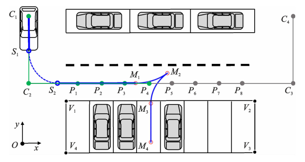

**停车场拓扑地图的描述**

- 节点：道路主节点（交叉路口，转弯处），停车位节点（车位前）

- 边：节点连接状态

如上图所示，点C1~C4为道路主节点；P1~P8为停车位节点；

**道路拓扑设计原则**

任意车位区域路侧边界与对应的道路主节点连线平行

如上图所示，车位区域路侧边界(V1, V2)与对应道路节点(C2, C3)连线平行，(C2, C3)尽可能为道路中心线，且与(V1, V2)之间预留安全行车距离。


路径规划的起点与终点（车的当前位置和用户输入）：搜索匹配到最近的节点


**结果展示**


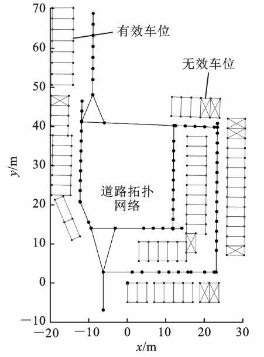


#### 传统地图导航

​		传统地图导航过程解析

1. 原始地图数据，如开源地图OpenStreetMap是一个建构自由内容之网上地图协作计划，目标是创造一个内容自由且能让所有人编辑的世界地图，并且让一般的移动设备有方便的导航方案。

    - OpenStreetMap主要三种元素：点（[Nodes](http://wiki.openstreetmap.org/wiki/Node)）、路（[Ways](http://wiki.openstreetmap.org/wiki/Way)）和关系（[Relations](http://wiki.openstreetmap.org/wiki/Relation)），这三种原始构成了整个地图画面。其中，[Nodes](http://wiki.openstreetmap.org/wiki/Node)定义了空间中点的位置；[Ways](http://wiki.openstreetmap.org/wiki/Way)定义了线或区域；[Relations](http://wiki.openstreetmap.org/wiki/Relation)（可选的）定义了元素间的关系。详见osm数据结构：https://blog.csdn.net/scy411082514/article/details/7484497

    - 地图渲染引擎：Osmarender，Mapnik，通过读取地图中的Node和Way的数据实时画(渲染)出来，例如2个Node组成了一条道路，那么就在这两点之间画一条直线，并且标记为道路，如果是封闭区域，并且根据数据，画出一个多边形，并把它标记为湖泊或者公园。最后生成位图(png, jpeg)和矢量图形(pdf, svg)。

2. 构建有向图（拓扑图）；原始地图数据的格式对渲染比较友好，而对最短路径搜索不是很友好，因此需要从原始地图数据中提取有用信息构建有向地图。

    - 节点：道路的起点、终点（交叉路口是一种特例）
    - 边：道路
    - 边的权重：道路的长度

    

3. 采用路径搜索算法，找到两点之间的最短距离
    - Dijkstra算法
    - A*算法
    - Bellman-Ford算法
    - SPFA算法（Bellman-Ford算法的改进版本）
    - Floyd-Warshall算法
    - Johnson算法
    - Bi-Direction BFS算法


#### 自动驾驶高清地图导航

参考apollo开源框架routing模块：

- Apollo开发社区-解析百度Apollo之Routing模块：https://mp.weixin.qq.com/s/4qUW_I_SCCt50d2qnDiq4Q

- apollo介绍之Routing模块：https://zhuanlan.zhihu.com/p/65533164


1. 原始高清地图数据，OpenDrive格式
2. 根据高清地图创建拓扑图
3. 路径搜索算法

​		高精度地图流行的格式有很多种，有的厂商直接基于rndf地图增加属性来制作高精度地图，也有厂商使用osm格式增加属性来制作高精度地图。 对于ADAS系统，则有ADASIS定义了地图的数据模型及传输方式，以CAN作为传输通道。 OpenDRIVE是一种开放的文件格式, 用于路网的逻辑描述，常用于高精度地图的制作，百度Apollo则使用基于OpenDRIVE格式改进过的高精度地图。


缘由

​		传统导航地图中(OpenStreetMap)，节点就是路的起点和终点（交叉，边就是道路。自动驾驶中的道路是车道线级别的，原来的这种定义点和边的方式就不适用了（定义不了车道），所以apollo中引用新的概念。注意区分道路(road)和车道(lane)的概念

节点：某一条具体车道

边：车道和车道之间的连接关系，是一个虚拟的概念。


<center> hdmap结构中的lane</center>

​		我们就知道车道之间的相互关系，也就知道了我们能否到达下一个车道，从而规划出一条到达目的地的车道线级别的路线，Planning模块在根据规划好的线路进行行驶，因为已经到车道线级别了，所以相对规划起来就简单很多。

在**直行道路**上，传统地图导航中表示为边，在自动驾驶高清地图导航中，**节点是一个个的lane，而边则代表lane之间的连接**。最后我们会建立一张如下的图


<center>拓扑图中的lane(表示成node)</center>

- **NODE** - 包括车道唯一id，长度，左边出口，右边出口（这里的出口对应车道虚线的部分，或者自己定义的一段允许变道的路段），**路段代价**（限速或者拐弯的路段会增加成本，代价系数在routing_config.pb.txt中定义)，中心线（虚拟的，用于生成参考线），是否可见，车道所属的道路id。
- **EDGE** - 则包括起始车道id，到达车道id，**切换代价**，方向（向前，向左，向右）。


车道编号朝负t方向呈降序且朝正t方向呈升序，同时注意左、右的定义

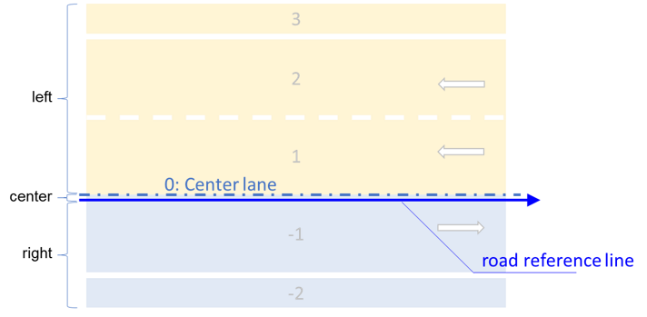


在**交叉路口**处，传统地图导航将交叉路口当作一个节点，在自动驾驶高精地图导航中，只用边描述车道之间的连接关系。

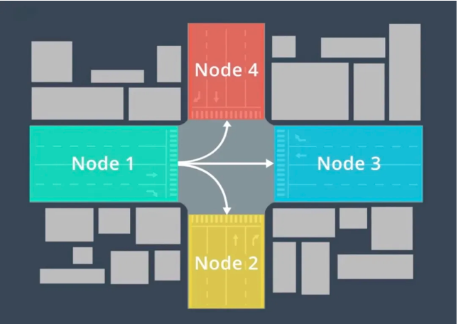


路径规划的起点与终点（车的当前位置和用户输入）：在起点和终点创建子图


#### 讨论与总结

**明确点**

- 明确前端矢量地图的格式（路径规划模块的输入）

- 明确后端规控输入要求（路径规划模块的输出）


**优缺点**

- 传统地图导航，优点是原理和实现较为简单，缺点是只达到道路级（导航精度较低，）

- 

    


**争议点**

基于拓扑图的路径规划，是否要达到车道线级别（像自动驾驶一样）？

- 如果**不要**达到车道级，则像传统地图的导航，从传统地图创建拓扑图，具体走哪一条车道，由规控决定。

- 如果**要**这到车道级，则像自动驾驶的导航，从高精度地图创建拓扑图


## 代码Routing涉及相关基本概念和规则

### 1-OpenDrive高精地图数据格式

官网：https://www.asam.net/standards/detail/opendrive/

快速预览：https://blog.csdn.net/lewif/article/details/78575840


OpenDrive地图文件格式为xml，主要结构如下所示，可以看出地图主要由Road和Junction组成


**道路Road**包含了地图中绝大多数信息，主要由参考线reference line、车道lanes及道路属性features组成

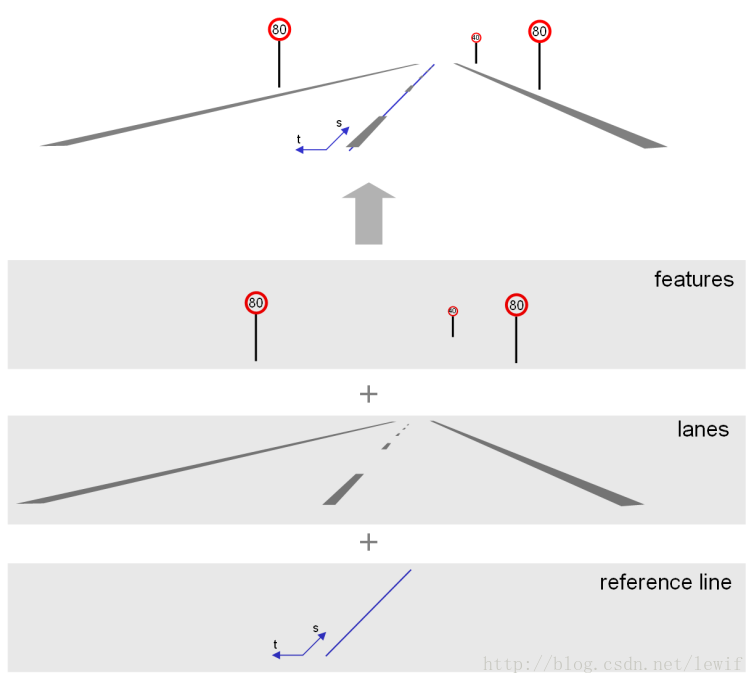

道路Road可以包含多条平行的车道Lanes，这一步地，车道Lanes还可以进行划分成车道段Lane section，如出现车道数量变更的情况，如下：

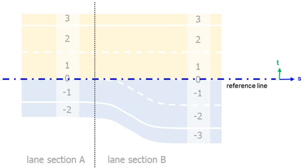

车道有不同的类型，如路肩shoulder，边界border，驾驶driving，紧急停车stop，


**交叉点junctions**主要针对道路前后连接关系不是很明确的情况，如交叉路口处，如下图中road 2的后置节点successor就无法确定。

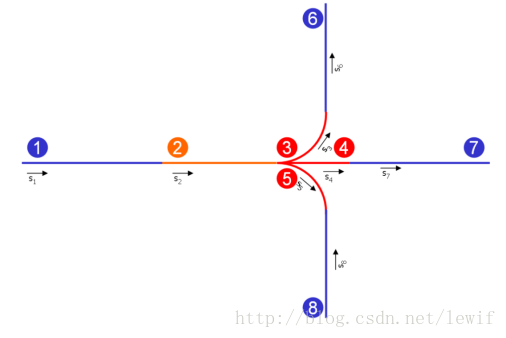

假设有如下十字路口

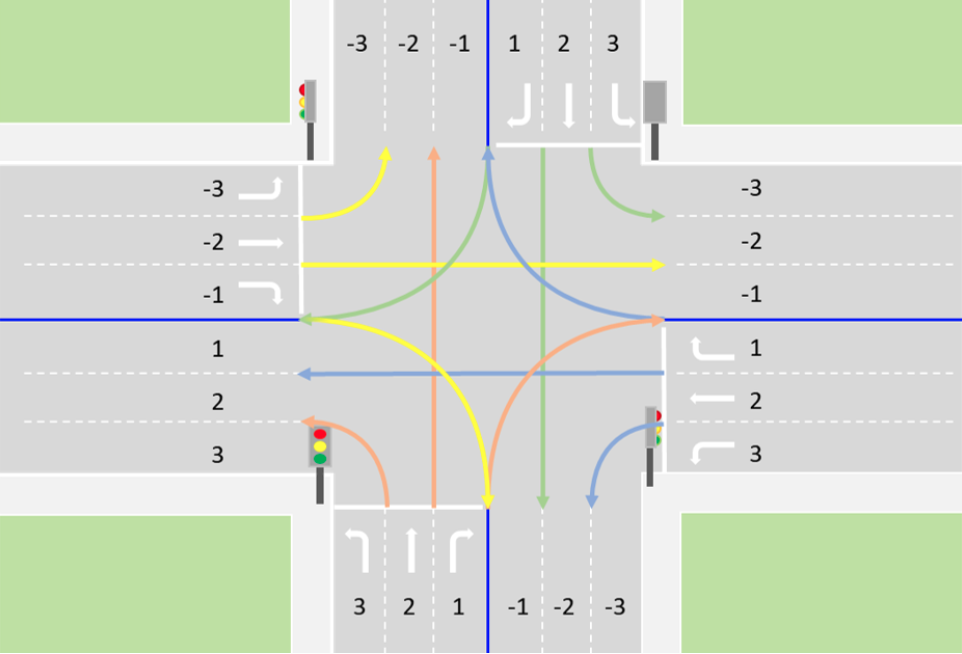


采用Junctions描述各个车道的连接关系，

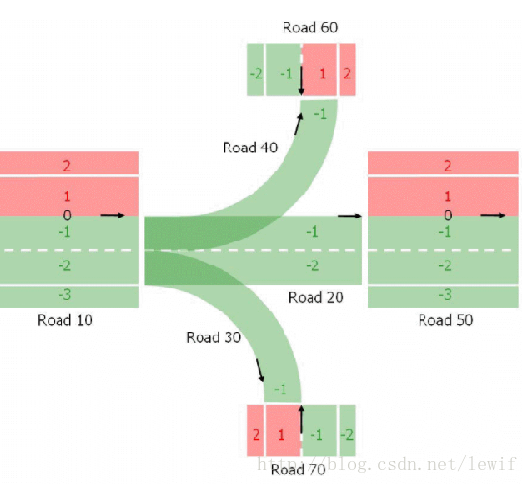


### 2-拓扑地图构建

拓扑图构建是指从高精度地图转化成拓扑图。拓扑图由节点和边组成，具体数据结构详见topo_graph.proto，主体部分如下所示：

```protobuf
// 车道上的一个节点，包含了所属车道，道路，长度，曲线起止点，中心线等信息
message Node {
  optional string lane_id = 1;          // 车道的id
  optional double length = 2;           // 车道的长度
  repeated CurveRange left_out = 3;     // 可以向左变道的曲线区间
  repeated CurveRange right_out = 4;    // 可以向右变道的曲线区间
  optional double cost = 5;             // Node上的cost表示什么？限速或者拐弯的路段会增加成本
  optional apollo.hdmap.Curve central_curve = 6;    // PointENU (x, y, z)类型 每隔0.2m取一点
  optional bool is_virtual = 7 [default = true];
  optional string road_id = 8;          // 所属的道路id
}

// 连接车道之间的边，包含了起止车道id，代价和方向等信息
message Edge {
  enum DirectionType {
    FORWARD = 0;        // 前后相接的都属于该类型，包括十字路口上左/右转弯
    LEFT = 1;           // 针对平行车道描述的左车道 
    RIGHT = 2;          // 针对平行车道描述的右车道
  }

  optional string from_lane_id = 1;
  optional string to_lane_id = 2;
  optional double cost = 3;
  optional DirectionType direction_type = 4;        // 如何定义LEFT/RIGHT(以车道方向为基准)，变道、掉头呢?
}

// 完整地图的Topo结构，这其中包含了多个Node和Edge
message Graph {
  optional string hdmap_version = 1;
  optional string hdmap_district = 2;
  repeated Node node = 3;
  repeated Edge edge = 4;
}
```


下面分别描述节点和边的生成规则，具体见文件夹`topo_creator`下的代码。

**节点生成规则：**

1. 只有车道类型为`驾驶driving`才会转换成节点，掉头车道的曲率不满足车辆最小转弯半径的不会转换成节点；

2. 节点（车道）类型：直行NO_TURN、转弯(左转车道LEFT_TURN、右转车道RIGHT_TURN、掉头车道U_TURN)

    2.1 直行车道（节点）的损失，由车道的长度，限速等因素决定，

    2.2 转弯车道具体还可分为左转车道、右转车道、掉头车道，**损失=车道长度+损失项**，损失项在配置文件routing_config.pb.txt中，如下

    ```
    left_turn_penalty: 50.0
    right_turn_penalty: 20.0
    uturn_penalty: 100.0
    ```


**边生成规则：**

1.  边描述节点（车道）之间的连接关系

2. 边的类型：LEFT、RIGHT、FORWARD


注意：节点类型只在apollo高精地图格式中存在，在生成拓扑图节点的损失时，和车道长度一起构成节点的损失，

​            而边的类型只存在于拓扑图中，在生成拓扑图过程中，根据车道之间的连接关系生成


**示例：**

十字路口(图中所示的边的类型都为FORWARD)

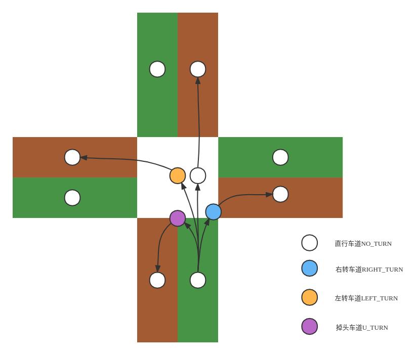


转弯

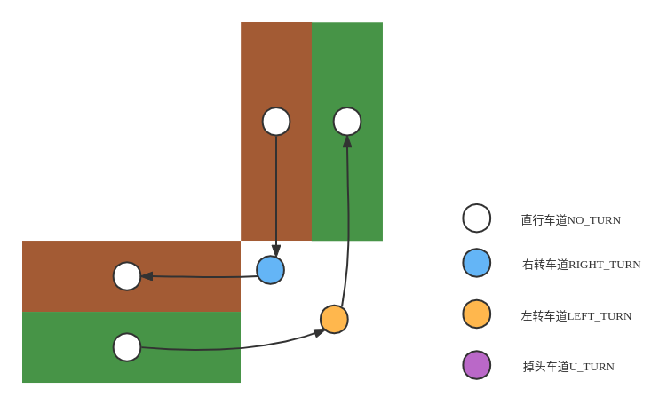


多平行车道

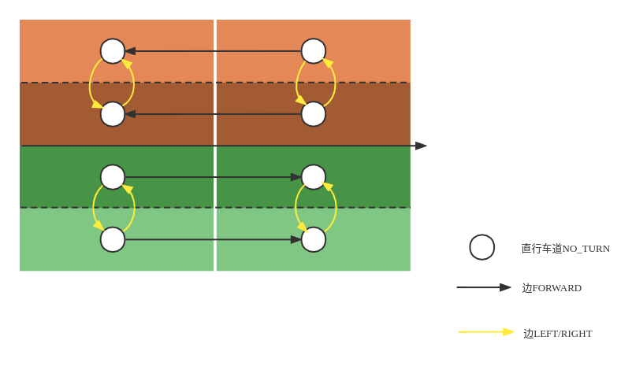


### 3-路径搜索算法

图解A*搜索算法: https://blog.csdn.net/JasonZhu_csdn/article/details/86266228

Introduction to the A* algorithm: https://www.redblobgames.com/pathfinding/a-star/introduction.html


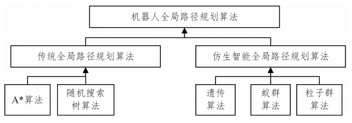


#### 广度优先搜索(Breadth First Search)

​    这些算法的核心思想是跟踪一个称之为“frontier”(边界)的扩展环，BFS遍历过程如下：

1. 从“frontier”(边界)拾取一个节点，同时标志为“访问过”

2. 根据该节点的邻居（且未访问过）进行扩展

3. 重复上述1-2过程


上述是一个遍历过程，如何找到最短路径？

记录下每个节点的来源(came-from)节点，如下图箭头所示。当到达目标节点后，根据箭头反向遍历，就可以得到一整条路径。


#### Dijkstra搜索算法

​		BFS算法只针对每次移动成都一样的情况，但在某些场景中，不同类型的移动会产生不同的成本。比如，车辆穿越平原或沙漠可能需要1个移动成本，但穿越森林或丘陵可能需要5个移动成本。

​		Dijkstra跟踪记录了每个“边界”上的节点从起始位置开始的总移动成本，优先遍历总移动成本低的节点。


总移动成本示意图


#### 启发式搜索-Greedy Best First Search

​		BFS和Dijkstra搜索算法沿各个方向搜索，适用于一个或多个搜索目标的场景，但很多情况是单目标路径搜索的情况。如何让“frontier”边界节点沿目标搜索，而不是沿各个方向搜索？

​		贪婪最佳优先搜索Greedy Best First Search利用**启发方式**引导“frontier”边界节点往目标点搜索。


​		但是在稍微复杂一些的场景中，得到的路径却不是最短路径，如下所示：


近似启发方式1：Manhattan距离

适用场景：可以沿东（右）、南（下）、西（左）、北（上）4个方向移动。曼哈顿距离不是距离不变量，当坐标轴变动时，点间的距离就会不同
$$
h = |x_1-x_2| + |y_1-y_2|
$$


近似启发方式2：对角距离

适用场景：可以沿东、南、西、北、东南、西南、东北、西北8个方向移动，即允许对角运动。
$$
h = max(|x_1-x_2|, |y_1-y_2|)
$$


近似启发方式3：欧氏距离

适用场景：可以沿任意方向移动
$$
h = \sqrt{(x_1-x_2)^2-(y_1-y_2)}
$$


#### A*搜索算法

​		Dijkstra可以找到最短路径，但它会浪费时间在没有希望的方向上搜索；Greedy Best First Search贪婪最佳优先搜索在最有可能的方向上进行探索，但可能找不到最短路径。

​		A*搜索算法则综合了两种算法的优点，即记录了每个“边界”上的节点（**当前节点**）从起始位置开始的移动成本$g(x)$，还估计了当前节点到目标节点的移动成本$f(x)$，优先遍历总移动成本$f(x)=g(x)+f(x)$低的节点。


#### 总结讨论

1. 最优路径方面

- BFS和Dijkstra搜索算法可以确保找到最短路径，贪婪最佳优先搜索算法GBFS无法保证
- A*算法能保证找到最短路径的前提是：在搜索过程中，启发式成本总不大于真实距离。当启发式成本变得很小时，`A*`算法变成Dijkstra算法，当启发式成本变得很大时，`A*`算法变成GBFS算法


2. 性能（时间复杂度）方面

    最直接有效的措施是减少不必要节点的个数。


3. 非网格地图

    网格地图本质上也是一种特殊的拓扑地图

    

     在网格地图上选取关键节点，构成拓扑地图


### 后端设计

​		决策规划模块负责生成车辆的行驶轨迹。要做到这一点，决策规划模块需要从宏观到局部经过三个层次来进行决策。

- **第一个层次是Routing的搜索结果。**Routing模块的输入是若干个按顺序需要达到的途径点（也可能只有一个起点和终点）。Routing模块根据地图的拓扑结构搜索出可达的完整路线来，这个路线的长度可能是几公里甚至几百公里。因此这个是最为宏观的数据。另外，Routing的搜索结果是相对固定的。在没有障碍物的情况下，车辆会一直沿着原先获取到的Routing路线行驶。只有当车辆驶出了原先规划的路线之外（例如：为了避障），才会重新发送请求给Routing模块，以重新计算路线。
- **第二个层次就是参考线。**决策规划模块会实时的根据车辆的具体位置来计算参考线。参考线的计算会以Routing的路线为基础。但同时，参考线会考虑车辆周边的动态信息，例如：障碍物，交通规则等。参考线包含车辆所在位置周边一定的范围，通常是几百米的长度。相较于Routing结果，它是较为局部的数据。
- **第三个层次是轨迹。**轨迹是决策规划模块的最终输出结果。它的依据是参考线。在同一时刻，参考线可能会有多条，例如：在变道的时候，自车所在车道和目标车道都会有一条参考线。而轨迹，是在所有可能的结果中，综合决策和优化的结果，最终的唯一结果。因此它是更为具体和局部的数据。轨迹不仅仅包含了车辆的路线，还包含了车辆行驶这条路线时的详细状态，例如：车辆的方向、速度、加速度等等。

决策规划相关技术汇总：https://apollo.auto/developer/index_cn.html#/learning?id=3

百度Apollo之决策规划模块： https://mp.weixin.qq.com/s?__biz=MzI1NjkxOTMyNQ==&mid=2247490814&idx=1&sn=1cca5d623c1b08e7b0fee23587468d13&scene=21#wechat_redirect

百度Apollo之参考线与轨迹： https://mp.weixin.qq.com/s/vMeKZvsGAKKQ57sCoXdOHw

